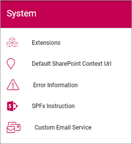

System
=============
Here, the following can be set:

Extensions
************
All extensions used in the tenant are listed here, with ID and version installed, for example:

.. image:: system-extensions-new.png

Default SharePoint Context Url
*******************************
Here the Default SharePoint address can be set/edited.

.. image:: system-default-sharepoint.png

Error Information
******************
Use this setting to turn client side error messages on or off (Default=off).

.. image:: system-settings-error.png

SPFx Instruction
*****************
(A description will be added soon.)

Custom Email Service
*********************
(A description will be added soon.)
