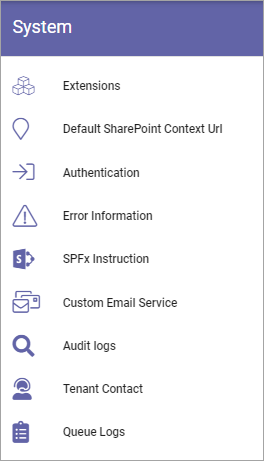
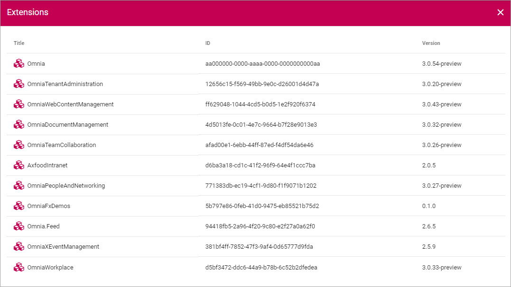

System
=============
Here, the following can be set:

Extensions
************
All extensions used in the tenant are listed here, with ID and version installed, for example:

Default SharePoint Context Url
*******************************
Here the Default SharePoint address can be set/edited.

.. image:: system-default-sharepoint.png

Authentification
*****************
The following can be enabled here:

.. image:: system-authentification.png

If Safari users in your organization has the Intelligent Tracking Prevention activated, this option has to be enabled in Omnia.

Error Information
******************
Use this setting to turn client side error messages on or off (Default=off).

.. image:: system-settings-error.png

SPFx Instruction
*****************
This is an instruction that may be needed for integration between Omnia and Sharepoint Team Sites.

Custom Email Service
*********************
If this setting is disabled, Omnia will use the SharePoint API:s for sending e-mails.
In some scenarios, for example when working with external users or when you want e-mails from Omnia to be sent from a specific e-mail address, you can enable this setting.
Enabling this allows you to select a user account (best practice is to setup a dedicated account). Omnia will then send e-mails using this dedicated user account via the Exchange API:s.

*Note: The selected user account need to have a cloud Exchange mailbox*

Audit Logs
***********
This option logs some important events in Omnia. In this version the following is logged:

+ Any changes of permissions anywhere in Omnia.
+ When this functionality is turned on or off.

The listing can look like this:

.. image:: audit-logs-list.png

+ **Title**: Here you can see a description of what has been changed.
+ **Logged By**: The name of the person that did the change is shown here.
+ **Logged At**: Date and time for when the change was made is shown in this column.

You can filter the list on dates, category and person, by using the fields at the top.

.. image:: audit-logs-list-filter.png

Further information can be accessed through the i-icon:

.. image:: audit-logs-icon.png

Here's an example:

.. image:: audit-logs-icon-example.png

The settings
-------------
You access the setting by clicking the cogwheel.

.. image:: audit-logs-list-settings.png

What you can do in the settings is simply turning Audit logging on or off (which is also logged).

.. image:: audit-logs-list-settings-settings.png

Tenant Contact
***************
It's very important that you add contact information here. This will be the main channel for information from Omnia. You can edit the contact information any time.

.. image:: tenant-contact.png

+ **Main Contacts**: Here you add the main contact person(s) in your organization, for Omnia. The main contact(s) will receive important announcements from the product team regarding retirement of features or major service interruptions.
+ **Security**: This contact(s) will recieve a message from the product team on any suspected or ascertained security breach in the system.
+ **Update Notification**: This contact(s) receive an automatic e-mail from the system whenever the tenant has been updated with a new version of the core product or any extension.
+ **Add External Main Contact, Security, Notification Email**: In these fields you can add email adresses to external partners that should recieve the same information.

Don't forget to save when you're done.

The e-mails that are sent about updates are sent from no-reply@omniacloud.net. You must make sure to check your junk mail or create a new rule in your e-mail system to trust this e-mail address.

Queue Logs
***********
Administrators can use this option to troubleshoot issues on site provisioning and other long running operations.

.. image:: queue-logs-1.png

Use the fields at the top to filter the list.

If something went wrong, information about what happened is made available through an i icon.

.. image:: queue-logs-2.png

Click the icon to view the information. Here's an example:

.. image:: queue-logs-3.png
