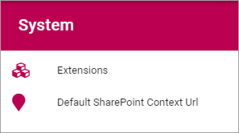

System
=============
Here, the following can be set:

Extensions
************
All extensions used in the tenant is listed here, with ID and version installed, for example:

.. image:: system-extensions.png

Default SharePoint Context Url
*******************************
Here the Default SharePoint address can be set/edited.

.. image:: system-default-sharepoint.png
