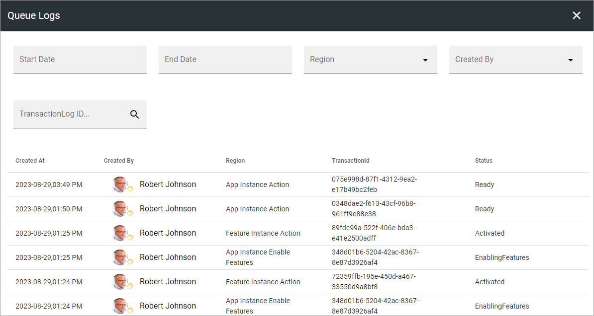
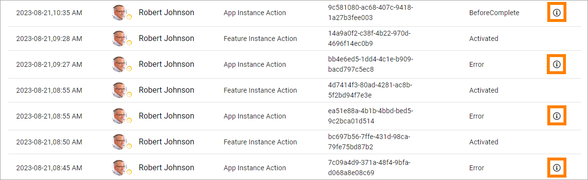
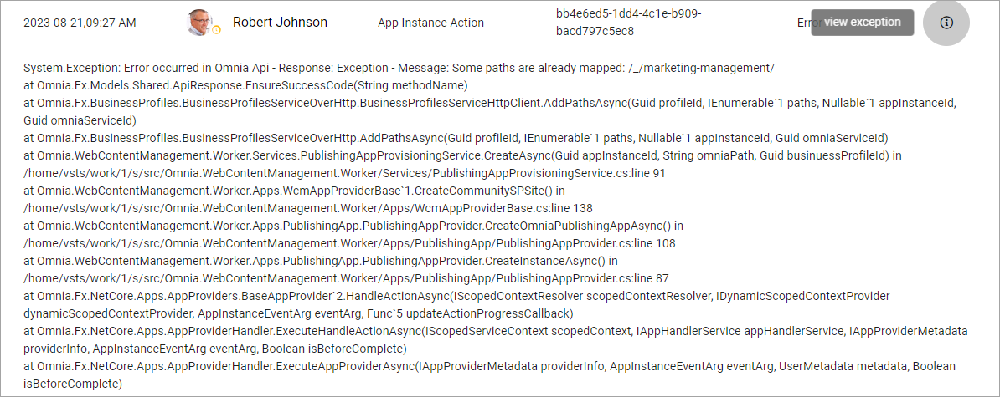

Queue Logs
=============

Administrators can use this option to troubleshoot issues on site provisioning and other long running operations.

Use the fields at the top to filter the list.

If something went wrong, information about what happened is made available through an i-icon.

Click the icon to view the information. Here's an example:

