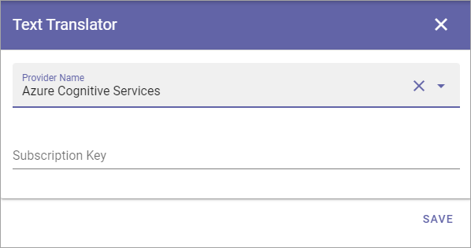

Text Translator
=======================================

If you have installed a separate text translator, use this option to select it. This option is available in Omnia 6.12 and later.

The Dafault translator is always available:

.. image:: text-translator-612.png

If you have installed another text translator you may have to add the subscription key here:

