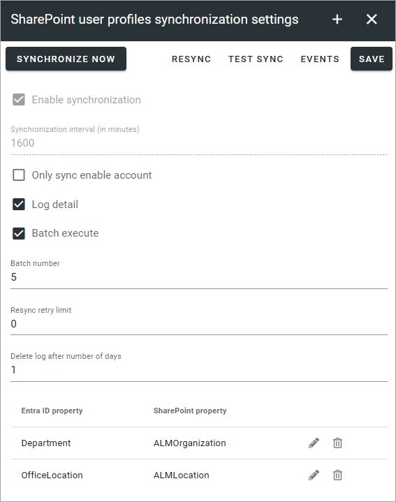
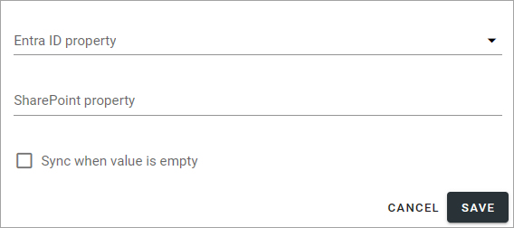
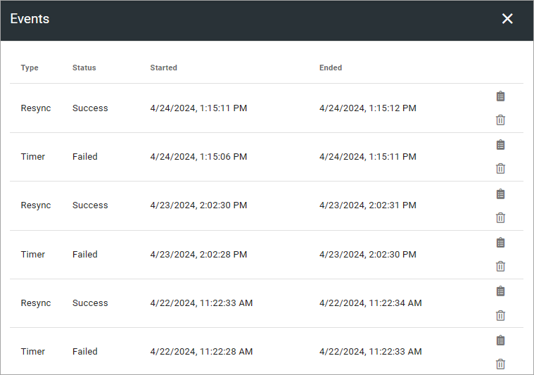

SharePoint User Profiles Sync
==============================================

This option was in earlier Omnia versions called "Azure AD Sync". Now, this option works this way:

Use these advanced settings to make sure person properties are synchronized from Entra ID to SharePoint. 

**Note:** The Entra ID Sync must be set up to use SharePoint Addin App identity instead of a user account. This will allow the tenant to turn off legacy sign in and still use the Entra ID Sync, see *Enable Sharepoint App-Only* below.

**Also note!** This option is not applicable in Omnia on-prem.

These settings and options are available here:

+ **SYNCHRONIZE NOW**: Click this button to execute the syncrhonizations set up (listed at the bottom). If you select "Enable Synchronization" and set and interval, you don't have to click this button. The synchronization is then executed with the interval set.
+ **Test Sync**: This is an option suitable for administrators to test synchronization for a limited number af users. Setup the sync to test as described below.
+ **EVENTS**: Click this button to access logs from the synchronizations. 
+ **Enable synchronization**: Select this option to enable the synchronization.
+ **Enable SharePoint App-Only**: Due to ongoing changes by Microsoft, Entra ID Sync may stop working. If that happens you have to setup SharePoint App-Only for Entra ID Sync. Click the link "Config instruction" and follow that instruction. When you're done, select this option.
+ **Only Sync Enable Account**: To only sync enabled accounts, select this option. Otherwise all, even disabled accounts, are synced.
+ **Log Detail**: Use this if you have problems with the synchronization. In the details you will hopefully find out what's wrong. 
+ **Batch Execute**: This is an advanced option if you have a very long list of users - several hundreds and above. Contact you provider/consultant for help when using this.
+ **Batch Number**: When you have selcected "Batch Execute" you use this field to set the number of users that should be synchronized each time.
+ **Delete log after number of days**: Set the number of days the log file will be available. Default: 14 days.

At the bottom the synchronizations that has been set up are shown. By clicking the pen you can edit the same settings as when the synchronization was set up (see below).

To delete a synchronization from the list, click the dust bin.

For a scheduled synchronization you also need to add an account in the Security settings (Secrets), see: :doc:`Security </admin-settings/tenant-settings/security/index>`

Setup a new synchronization
*****************************
To set up a new synchronization, do the following:

1. Click the plus.
2. Use the following settings:

+ **Entra ID property**: Open the list and select the AD property to synchronize.
+ **SharePoint property**: Type the name of the SharePoint property to synchronize to.
+ **Sync when value is empty**: Normally empty fields are not synchronized. If you want to do that, select this option.

3. Save when your finished here.
4. Save your changes in the settings window.

**Note!** SharePoint user profile sync property mappings are not case sensitive.

Events
********
In the list each synchronization is described with type, status and start- and end time. The top icon for each post will show more details. Here's where you will see detailed log if you selected "Log details". (Image from a test environment).

