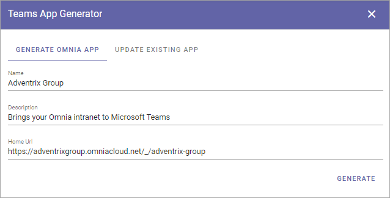
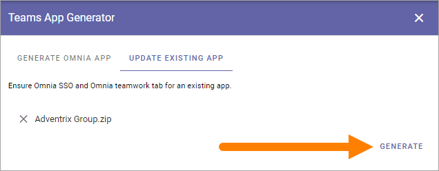

Teams App Generator
=====================================

Use these options for an easy starting point creating an Teams App for Omnia, or to update an app you already have.

Generate Omnia App
**********************
Add a title for the app, a description and the home url, and click GENERATE.

The app is created and downloaded as a zip to your Download library.

The app is actually ready for use but there may be some more settings you want to do, using Developer Portal.

Additional settings
--------------------
**The following two sections are preliminary, will be tested in more detail soon.**

There are some additional settings you may want to do using Developer Portal, especially icons, but there may be more you would like to do.

Either use the Developer Portal as an app in Teams or at dev.teams.microsoft.com.

1. Importer the app you created (don't mind the errors, fix them as below).
2. Go to Branding and add a Color icon and an Outline icon with the correct sizes.
3. Make other changes you would like to do.
4. Publish the edited app (Publish to org).

Publish the app
----------------
1. Go to Teams Administration in central MS 365 admin.
2. Go to Teams apps and then Manage apps, and find your app.

Note the it can take som time before your app is listed there. If you can't find it yet, just wait a bit.

3. Create a Setup Policy.
4. Publish the app.
5. Wait a while for the app to be fully processed (can sometimes take up to an hour).

Also note that it may take up to 24 hours befoew users have access to the app in Teams.

Update Existing App
***********************
In Omnia 6.10 the Omnia App has some new options. If you already have an Omnia App and would like to update it to the full 6.10 options, use this tab. What the possible update is about is stated in the description text: "Ensure Omnia SSO and Omnia teamwork tab for an existing app".

To update an app, drag and drop or Browse to load it.

.. image:: teams-app-generator-update.png

And then click GENERATE.

The app is updated and downloaded to your Download library.

