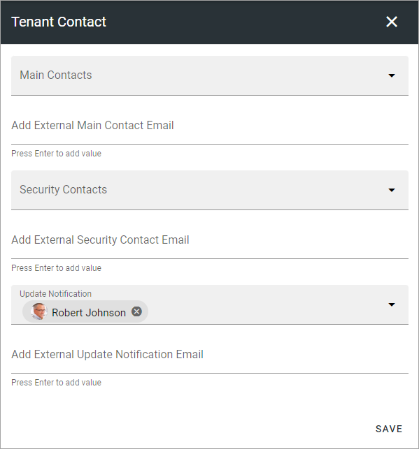

Tenant Contact
=================

It's very important that you add contact information here. This will be the main channel for information from Omnia. You can edit the contact information any time.

**Note! This option is not applicable for Omnia on-prem.

+ **Main Contacts**: Here you add the main contact person(s) in your organization, for Omnia. The main contact(s) will receive important announcements from the product team regarding retirement of features or major service interruptions.
+ **Security**: This contact(s) will recieve a message from the product team on any suspected or ascertained security breach in the system.
+ **Update Notification**: This contact(s) receive an automatic e-mail from the system whenever the tenant has been updated with a new version of the core product or any extension.
+ **Add External Main Contact, Security, Notification Email**: In these fields you can add email adresses to external partners that should recieve the same information.

Don't forget to save when you're done.

The e-mails that are sent about updates are sent from no-reply@omniacloud.net. You must make sure to check your junk mail or create a new rule in your e-mail system to trust this e-mail address.

