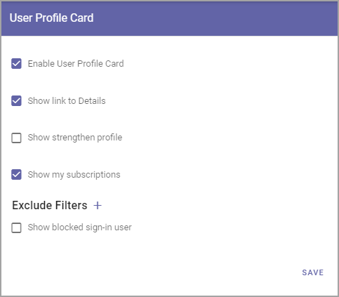

User Profile Card
===================

**This page is being updated. Will be finishad soon.**

The user profile card will be shown (if this functionality is activated) whenever you click on a user name in Omnia. The user profile card is designed to align with user profile cards in other services in Microsoft 365.

Here's how a profile card can look:

.. image:: profile-card-example-jorg.png

**Note!** In Omnia on-prem, all options referring to Delve is removed, as it's a Microsoft 365 feature and therefore not available on-prem.

The user profile card also includes the possibility to browse who reports to who in the organization. Here's an example:

.. image:: profile-card-example-jorg2.png

Settings
***********
The following settings are available:

+ **Enable User Profile Card**: If the Profile Card should be used within the tenant, select this option. If you choose not to, the person's Delve profile is shown instead.
+ **Show link to Details**: If it should be possible to go to the person's profile from the User Profile Card, select this option. In Omnia online the person's Delve page is linked to when this option is selected (see the Go to Delve link in images aboove). In Omnia onPrem, the link goes to the person's My Profile page.
+ **Show Strengthen Profile**: If the Strengthen Profile button should be shown on the card, select this option. The button is used to access the Strengthen Profile dialog.
+ **Show my subscriptions**: If the My Subscription button should be shown on the card, select this option. The button is used to access the My Subscriptions dialog.
+ **Exclude filters**: (a description will be added soon).
+ **Show blocked sign-in user**: (a description will be added soon).

For more information about Strengthen Profile, see this page: :doc:`Strengthen Profile </user-options/strengthen-profile/index>`

For more information about My Subscriptions, see this page: :doc:`Strengthen Profile </user-options/my-subscriptions/index>`

