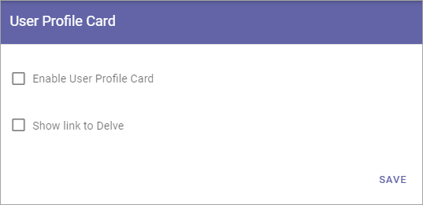

User Profile Card
===================

This is an ongoing, preliminary documentation for new functionality to come in Omnia 6.5. 

The new user profile card will be shown (if this functionality is activated) whenever you click on a user name in Omnia. The user profile card is designed to align with user profile cards in other services in Microsoft 365.

Here's how a profile card can look:

.. image:: profile-card-example-jorg.png

The new user profile card also includes the possibility to browse who reports to who in the organization.

.. image:: profile-card-example-jorg2.png

Settings
***********
The following settings are available:

+ **Enable User Profile Card**: If the Profile Card should be used within the tenant, select this option. If you choose not to, the person's Delve profil is shown instead.
+ **Show link to Delve**: If it should be possible to go to the person's Delve profile from the User Profile Card, select this option.

