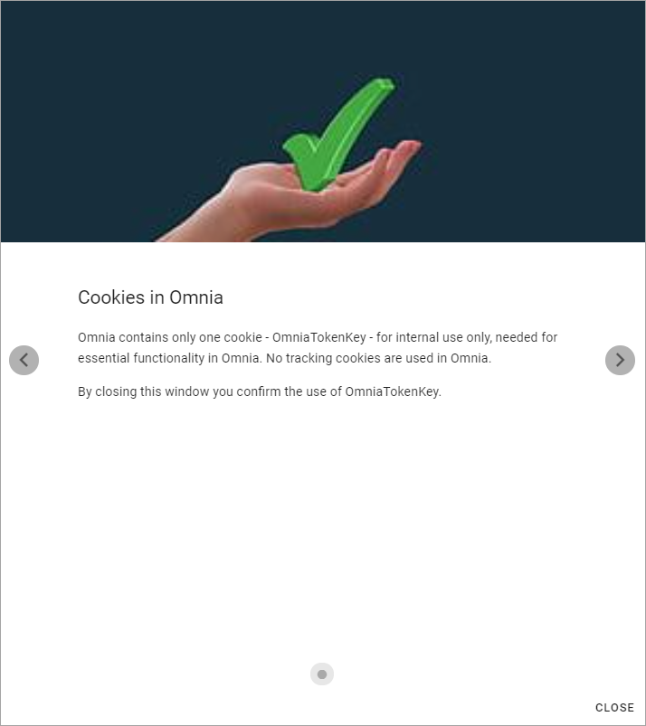

Cookies Consent information
===============================

If you need to add Cookies Consent information for a customer a tip is to use the Tutorial for this purpose. 

Here's a suggestion for the text:

Omnia contains one cookie - OmniaTokenKey - for internal use only, needed for essential functionality in Omnia. No tracking cookies are used in Omnia. By closing this window you confirm the use of OmniaTokenKey. 

You should set this Tutorial to be available at the start page and to start automatically.

It can look something like this in the Tutorial window:

