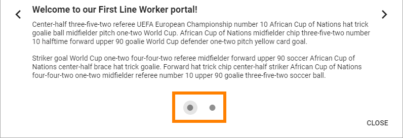
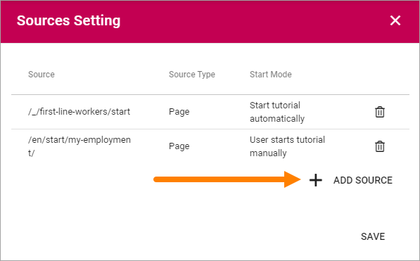
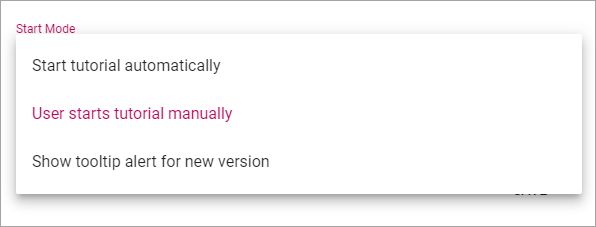
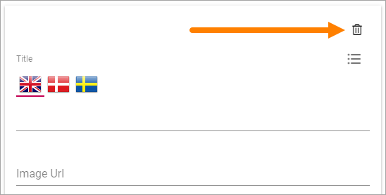
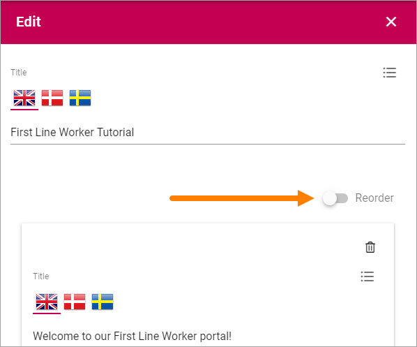

Tutorial
=====================

**(This description is just started, more will be added soon.)**

Using this option in Omnia Admin a Tenant Administrator can create and edit tutorials for selected publishing pages. 

The User Experience
*******************
A tutorial can be set up to start automatically when a page is opened (see more info below). But if it's not, users select the "Tutorial" icon in the heading:

.. image:: tutorial-icon-users.png

Here's an example of a Tutorial:

.. image:: tutorial-example.png

The user can see the number of Tutorial steps, here:

And can navigate between the steps using these buttons:

.. image:: tutorial-navigation.png

Create or edit a Tutorial
****************************
Do the following to create a new Tutorial:

1. Click the plus.

.. image:: tutorial-click-plus.png

Do the follwing to edit an existing Tutorial:

1. Click the pen for the Tutorial.

.. image:: tutorial-click-pen.png

Use the following settings:

..image:: tutorial-settings-1.png

+ **Title (top)**: Add/edit the title for the Tutorial (not shown for users). You can add a title in all languages used in the tenant, the default language is mandatory.
+ **Reorder**: When you have added a number of steps (see below), use this button to reorder the steps.

The following fields are avilable for each step in the Tutorial:

+ **Title**: This is the title shown for users. You can add a title in all languages used in the tenant, the default language mandatory. Which langauge will be shown for a user depends on that user's preferred language setting.
+ **Image Url**: When you have added an image for the step, the url is shown here.
+ **Add Image**: To add an image to the step, click this link and use the Media Picker. It's not mandatory to add an image. See this page for more information about the Media Picker: :doc:`The Media Picker </general-assets/media-picker/index>`
+ **Content**: Use this field to add the text for this step. Some basic formatting options are available. You can add Content in all languages used in the tenant, the default language mandatory. Which langauge will be shown for a user depends on that user's preferred language setting.

Further down, the following settings are available:

..image:: tutorial-settings-2.png

When you have added a number of steps you can use the dots in the bar to go to another steop, to edit that step.

+ **Add step**: Use the button to add a new tutorial step after the last step. 

hen you add a step, you can see that another dot is created in the navigation bar. Use the fields to add a Title, Image and Content as described above.

.. tutorial-new-step.png

+ **Preview tutorial**: When you want to check how the tutorial will look for users, select this button. 
+ **Source Setting**: To select pages where this Tutorial should be available, click here. The number to the right of the link indicates the number of pages selected.

Use these settings to select pages:

.. image:: tutorial-source-settings.png

You can edit a source, just add or delete. To delete, click the dust bin for the source.

To add a page, do the following:

1. Click "Add Source".

Use these settings:

.. image:: source-settings.png

+ **Source Type**: Always Page, and it's already selected.
+ **Path**: Add or paste the path to the page here. See the second image above for examples of paths.
+ **Start Mode**: Select Start Mode here. Note that you can select different Start Modes for different sources (pages), for the same Tutorial.

The following is available under "Start Mode":

The Tool Tip Alert will be shown on the Tutorial icon.

+ **Add**: When you have entered the settings for a source, you must click "Add" to add the source to the list.
+ **Save**: When all sources are added, click here to save the source settings.

Delete a step
**********************
To delete a step in the Tutorial, do the following:

1. Got to the step using the navigation bar with the dots.
2. Click the dust bin:

Reorder steps
**************
The Tutorial steps are always ordered as you create them, a new step always placed last. If you need to reorder the steps, do the following:

1. Active the "Reorder" button.

Something like the following is shown:

.. image:: reordering.png

Use drag and drop to reorder.
