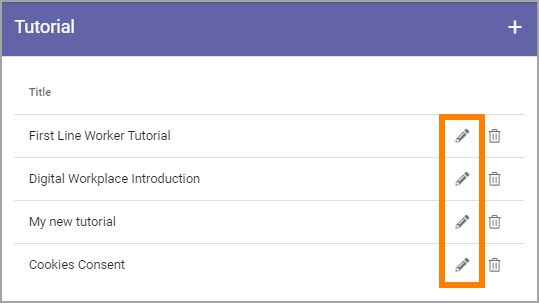
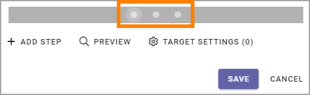
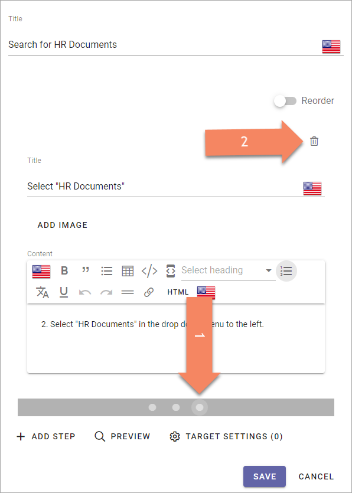
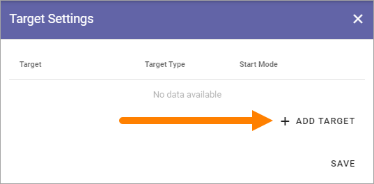
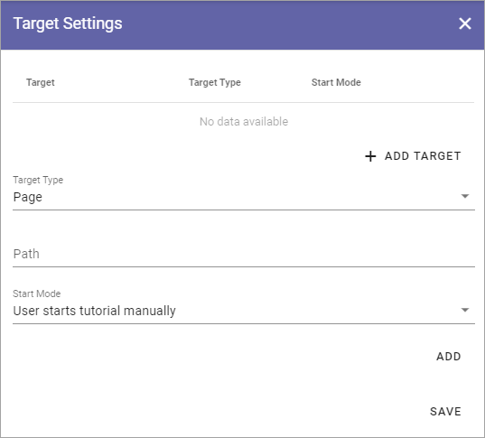

Tutorial
=====================

Using this option in Omnia Admin a Tenant Administrator can create and edit Tutorials for selected publishing pages. 

A Tutorial can be set up to start automatically when a page is opened. But if it's not, users select the "Tutorial" icon in the heading or in the menu.

**Note!** For the tutorial to start automatically, the tutorial must be set up in the action menu.

For an implementation example, see this page: :doc:`Tutorial implementation example </admin-settings/tenant-settings/tutorial/tutorial-implementation/index>`

Create or edit a Tutorial
****************************
Do the following to create a new Tutorial:

1. Click the plus.

.. image:: tutorial-click-plus-new.png

Do the following to edit an existing Tutorial:

1. Click the pen for the Tutorial.

2. Use the following settings:

.. image:: tutorial-settings-1-new2.png

+ **Title**: Add/edit the title for the Tutorial (not shown for users). You can add a title in all languages used in the tenant (Click the flag to change language).
+ **Add step**: Use the button to add a new tutorial step after the last step. 
+ **Preview**: When you want to check how the tutorial will look for users, select this button. 
+ **Target Settings**: To select pages where this Tutorial should be available, click here. The number to the right of the link indicates the number of pages selected. You also use the Target Setting to set if the tutorial should start automatically or not.

The following fields and options are available for the steps in the Tutorial:

.. image:: tutorial-steps-settings-new.png

+ **Reorder**: When you have added a number of steps, use this button to reorder the steps. (See below for more information).
+ **Title**: This is the title for the step, and it's shown for users. You can add a title in all languages used in the tenant, click the flag to change language. To langauge shown for a user depends on that user's preferred language setting.
+ **Add Image**: To add an image to the step, click this link and use the Media Picker. It's not mandatory to add an image. See this page for more information about the Media Picker: :doc:`The Media Picker </general-assets/media-picker/index>`
+ **Content**: Use this field to add the text for this step, using the RTF Editor. The langauge shown for a user depends on that user's preferred language setting. For more information about how to use the RTF Editor, see: :doc:`Editing text with the RTF Editor </general-assets/rtf-editor/index>`

When you add a step, you can see that another dot is created in the navigation bar. Click the dot to go to a step for editing.

Reorder or delete steps
-------------------------
The Reorder option is a convenient option of displaying the steps you have created, and to manage the order.

.. image:: tutorial-reorder.png

You can display the text for a step by expanding:

.. image:: tutorial-reorder-expand.png

To reorder the steps, use drag and drop.

To delete a step that is no longer needed, do the following:

1. Select the step by clicking the dot.
2. Check that it is the step you intend to delete.
3. Click the dust bin.

Edit or delete the image
---------------------------
When you have added an image for a step, you can edit or delete it the same way as you do for an image on a page.

.. image:: tutorial-edit-image.png

Use the pen to edit, the X to delete the image.

For image editing, see this page: :doc:`Media Picker </general-assets/media-picker/index>`

Target settings
------------------
Use these settings to select the pages where the tutorial should be available, and to set how it should be available:

.. image:: source-settings-new2.png

To add a page, do the following:

1. Click "Add Target".

Use these settings:

+ **Target Type**: It's always Page, and it's already selected.
+ **Path**: Add or paste the path to the page here. **Note!** Only relative paths are supported.
+ **Start Mode**: Select Start Mode here. Note that you can select different Start Modes for different pages, for the same Tutorial.

The following is available under "Start Mode":

.. image:: tutorial-start-mode-new.png

+ **Start the tutorial automatically**: The tutorial starts when the user enters the page, but when the user has closed the tutorial, it can still be available as an icon or in the menu, if set up that way.  
+ **User starts tutorial manually**: The tutorial can be made available through the Action Menu, either as an icon or in the menu. Note that this has to be set up as well in the Header settings for the Business Profile.
+ **Show alert for new version**. If the tutorials are available through an icon and a tutorial is updated, a Tool Tip Alert will be shown on the Tutorial icon. 

**Important note**: The tutorial must be available through the Action Menu, meaning set up as a menu option or as an icon, even if it should start automatically.

When you're done with a target setting, or with all target settings for a tutorial, use Add and Save this way:

.. image:: tutorial-add-save.png

+ **Add**: When you have entered the settings for a page, you must click "Add" to add the page to the list.
+ **Save**: When all sources are added, click here to save the source settings.

You can't edit a target, just add or delete. To delete, click the dust bin for the target.

.. image:: target-delete.png

