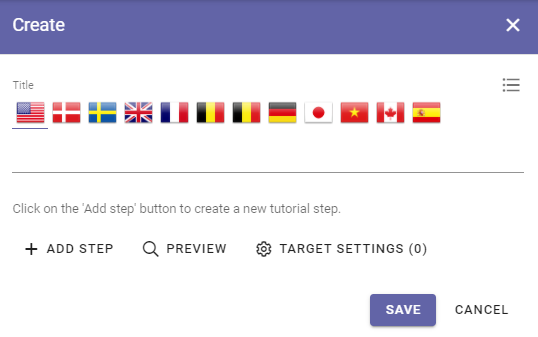
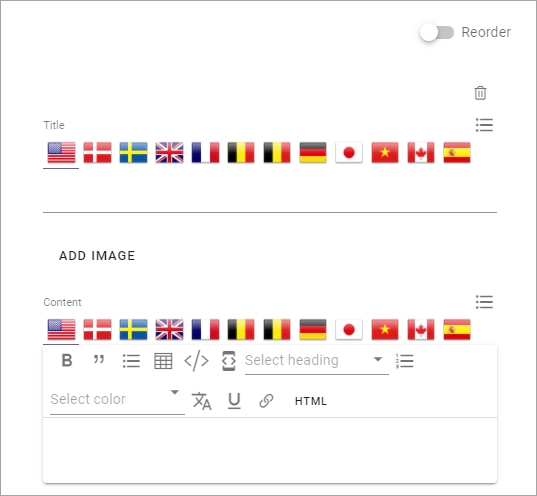
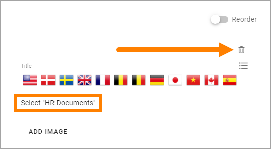
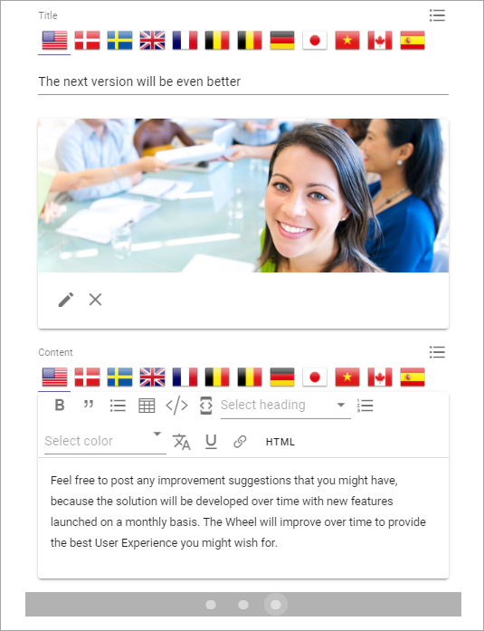
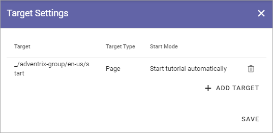

Tutorial
=====================

Using this option in Omnia Admin a Tenant Administrator can create and edit Tutorials for selected publishing pages. 

A Tutorial can be set up to start automatically when a page is opened. But if it's not, users select the "Tutorial" icon in the heading or in the menu.

See below for an implementation example.

Create or edit a Tutorial
****************************
Do the following to create a new Tutorial:

1. Click the plus.

.. image:: tutorial-click-plus-new.png

Do the following to edit an existing Tutorial:

1. Click the pen for the Tutorial.

.. image:: tutorial-click-pen-new.png

2. Use the following settings:

+ **Title (top)**: Add/edit the title for the Tutorial (not shown for users). You can add a title in all languages used in the tenant, the default language is mandatory.
+ **Add step**: Use the button to add a new tutorial step after the last step. 
+ **Preview tutorial**: When you want to check how the tutorial will look for users, select this button. 
+ **Target Settings**: To select pages where this Tutorial should be available, click here. The number to the right of the link indicates the number of pages selected. You also use the Target Setting to set if the tutorial should start automatically or not.

The following fields and options are available for the steps in the Tutorial:

+ **Reorder**: When you have added a number of steps, use this button to reorder the steps. (See below for more information).
+ **Title**: This is the title for the step, and it's shown for users. You can add a title in all languages used in the tenant, the default language mandatory. Which langauge will be shown for a user depends on that user's preferred language setting.
+ **Add Image**: To add an image to the step, click this link and use the Media Picker. It's not mandatory to add an image. See this page for more information about the Media Picker: :doc:`The Media Picker </general-assets/media-picker/index>`
+ **Content**: Use this field to add the text for this step. Some basic formatting options are available. You can add Content in all languages used in the tenant, the default language mandatory. Which langauge will be shown for a user depends on that user's preferred language setting.

When you add a step, you can see that another dot is created in the navigation bar. Click the dot to go to a step for editing.

.. tutorial-new-step-new.png

Reorder or delete steps
-------------------------
The Reorder option is a convenient option for displaying the steps you have created, and to manage the order.

.. image:: tutorial-reorder.png

You can display the text for a step på expanding the step:

.. image:: tutorial-reorder-expand.png

To reorder the steps, use drag and drop.

To delete a step that is no longer needed, do the following:

1. Select the step by clicking on the dot.

.. image:: tutorial-delete-step-1.png

2. Check that it is the step you intend to delete.
3. Click the dust bin.

Edit or delete the image
---------------------------
When you had added an image for a step, you can edit or delete it the same way as you do for an image on a page.

.. image:: tutorial-edit-image.png

Use the pen to edit, the X to delete the image.

For image editing in Omnia v6, see this page: :doc:`Media Picker (v6) </general-assets/media-picker/media-picker-v6/index>`

Target settings
------------------
Use these settings to select pages and set how the tutorial should be available:

.. image:: source-settings-new2.png

To add a page, do the following:

1. Click "Add Target".

.. image:: click-add-source-new2.png

Use these settings:

.. image:: source-settings2-new2.png

+ **Target Type**: It's always Page, and it's already selected.
+ **Path**: Add or paste the path to the page here. 
+ **Start Mode**: Select Start Mode here. Note that you can select different Start Modes for different pages, for the same Tutorial.

The following is available under "Start Mode":

.. image:: tutorial-start-mode-new.png

The Tool Tip Alert will be shown on the Tutorial icon.

+ **Add**: When you have entered the settings for a page, you must click "Add" to add the page to the list.
+ **Save**: When all sources are added, click here to save the source settings.

You can't edit a target, just add or delete. To delete, click the dust bin for the target.

.. image:: target-delete.png

Tutorial - implementation example
***********************************
This example consists of three steps:

.. image:: tutorial-example-1.png

These settings has been made for the first step:

.. image:: tutorial-example-2.png

and these settings for the second step:

.. image:: tutorial-example-3.png

and these for the third:

The tutorial is targeted to just one page and will start automatically:

In the header for the Business Profile, it has been set that tutorials should be available in the Action Menu. The icon is shown where a tutorial is available, but not shown otherwise.

.. image:: tutorial-example-6.png

"Pinned" means shown as an icon. Another option is to make tutorials available in the menu, as you can see has been set for Omnia Admin and Strenghten Profile in this example.

The user experience:

The steps will be shonw for users this way:

.. image:: tutorial-example-7.png
.. image:: tutorial-example-8.png
.. image:: tutorial-example-9.png

Users can navigate the tutorial using the dots or the arrows:

.. image:: tutorial-example-10.png

In this example, the tutorial starts automatically the first time the user enters the page, but after that it can be started using the Tutorial icon:

.. image:: tutorial-example-11.png

If the settings for the Business Profile Header had been Menu

.. image:: tutorial-example-12.png

no icon would have been shown and the tutorial would be availabel in the menu instead:

.. image:: tutorial-example-13.png

