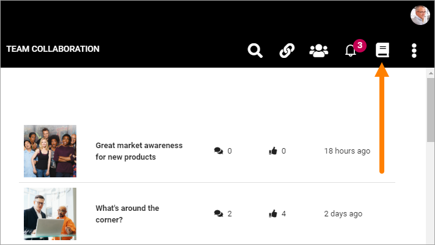
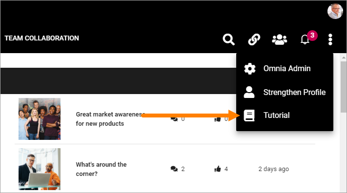
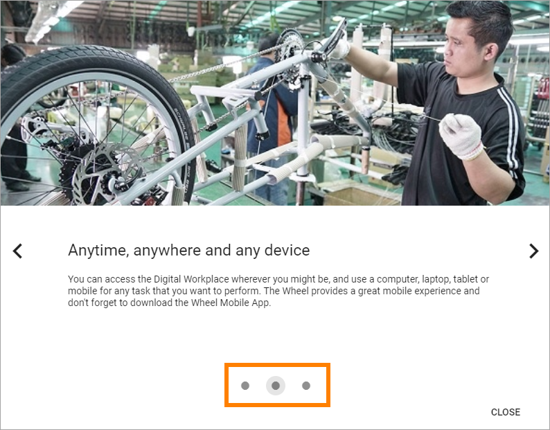
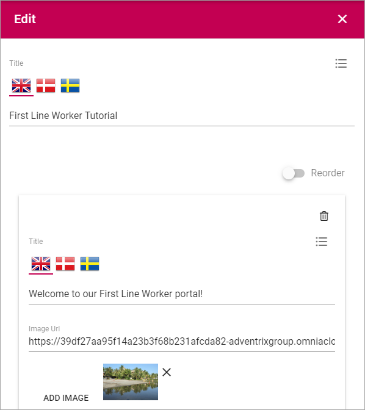
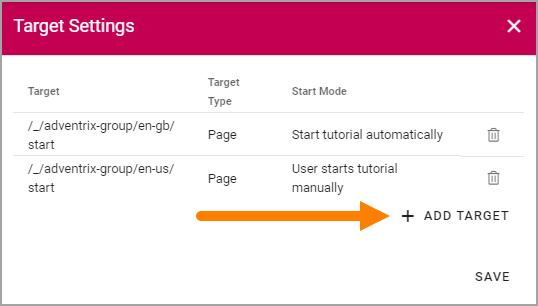
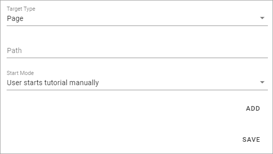
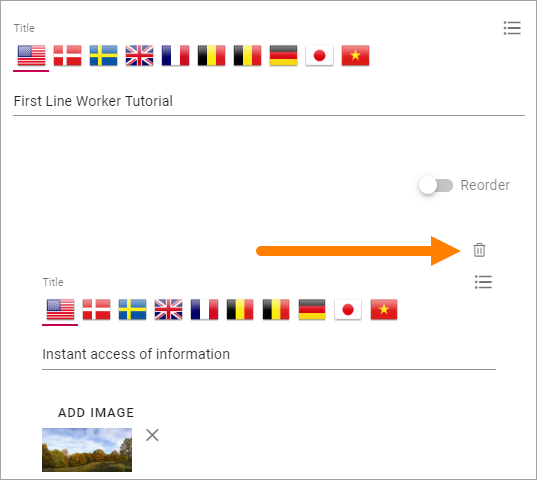
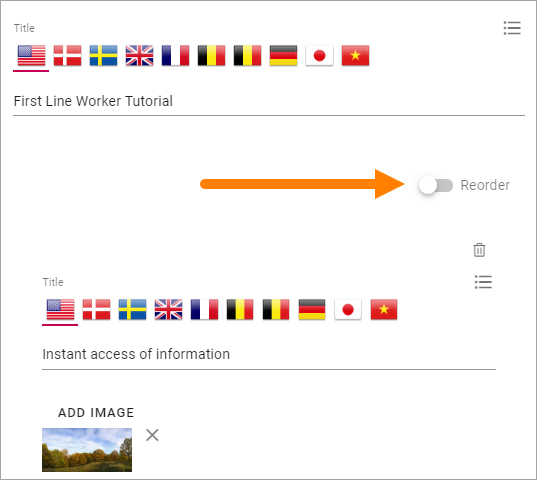

Tutorial
=====================

Using this option in Omnia Admin a Tenant Administrator can create and edit Tutorials for selected publishing pages. 

The User Experience
*******************
A Tutorial can be set up to start automatically when a page is opened (see more info below). But if it's not, users select the "Tutorial" icon in the heading:

The tutorial can also be set up to be started in the Menu, for example:

See below for more on where to set this.

Here's an example of a Tutorial:

.. image:: tutorial-example-new.png

The user can see the number of Tutorial steps, here:

And can navigate between the steps using these buttons:

.. image:: tutorial-navigation-new2.png

Create or edit a Tutorial
****************************
Do the following to create a new Tutorial:

1. Click the plus.

.. image:: tutorial-click-plus.png

Do the follwing to edit an existing Tutorial:

1. Click the pen for the Tutorial.

.. image:: tutorial-click-pen.png

2. Use the following settings:

+ **Title (top)**: Add/edit the title for the Tutorial (not shown for users). You can add a title in all languages used in the tenant, the default language is mandatory.
+ **Reorder**: When you have added a number of steps (see below), use this button to reorder the steps.

The following fields are avilable for each step in the Tutorial:

+ **Title**: This is the title shown for users. You can add a title in all languages used in the tenant, the default language mandatory. Which langauge will be shown for a user depends on that user's preferred language setting.
+ **Add Image**: To add an image to the step, click this link and use the Media Picker. It's not mandatory to add an image. See this page for more information about the Media Picker: :doc:`The Media Picker </general-assets/media-picker/index>`
+ **Content**: Use this field to add the text for this step. Some basic formatting options are available. You can add Content in all languages used in the tenant, the default language mandatory. Which langauge will be shown for a user depends on that user's preferred language setting.

Further down, the following settings are available:

.. image:: tutorial-settings2-new.png

When you have added a number of steps you can use the dots in the bar to go to another steop, to edit that step.

+ **Add step**: Use the button to add a new tutorial step after the last step. 

When you add a step, you can see that another dot is created in the navigation bar. Use the fields to add a Title, Image and Content as described above.

.. tutorial-new-step.png

+ **Preview tutorial**: When you want to check how the tutorial will look for users, select this button. 
+ **Target Settings**: To select pages where this Tutorial should be available, click here. The number to the right of the link indicates the number of pages selected.

3. Use these settings to select pages:

.. image:: source-settings-new.png

You can edit a target, just add or delete. To delete, click the dust bin for the target.

To add a page, do the following:

1. Click "Add Target".

Use these settings:

+ **Target Type**: It's always Page, and it's already selected.
+ **Path**: Add or paste the path to the page here. See the second image above for examples of paths.
+ **Start Mode**: Select Start Mode here. Note that you can select different Start Modes for different pages, for the same Tutorial.

The following is available under "Start Mode":

.. image:: tutorial-start-mode-new.png

The Tool Tip Alert will be shown on the Tutorial icon.

+ **Add**: When you have entered the settings for a page, you must click "Add" to add the page to the list.
+ **Save**: When all sources are added, click here to save the source settings.

Delete a step
**********************
To delete a step in the Tutorial, do the following:

1. Go to the step using the navigation bar with the dots.
2. Click the dust bin:

Reorder steps
**************
The Tutorial steps are always ordered as you create them, a new step always placed last. If you need to reorder the steps, do the following:

1. Activate the "Reorder" button.

Something like the following is shown:

.. image:: reordering.png

Use drag and drop to reorder.

Set where to start a Tutorial
******************************
If a Tutorial is set to be started manually the Header/Action Menu settting for the Business Profile decides where the Tutorial Icon will be displayed. See the section "Action Menu" on this page for more information: :doc:`Settings (for Business Profile) </admin-settings/business-group-settings/settings/index>`
