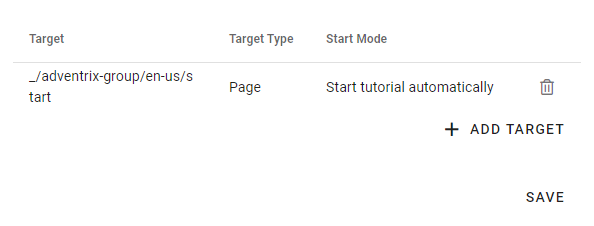
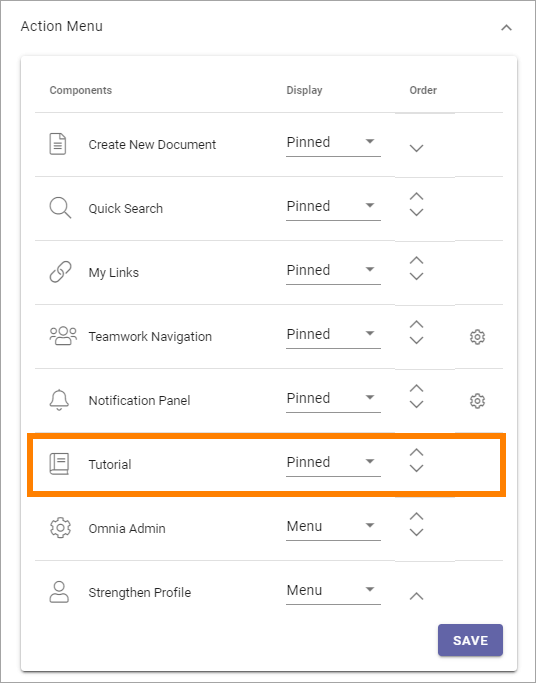
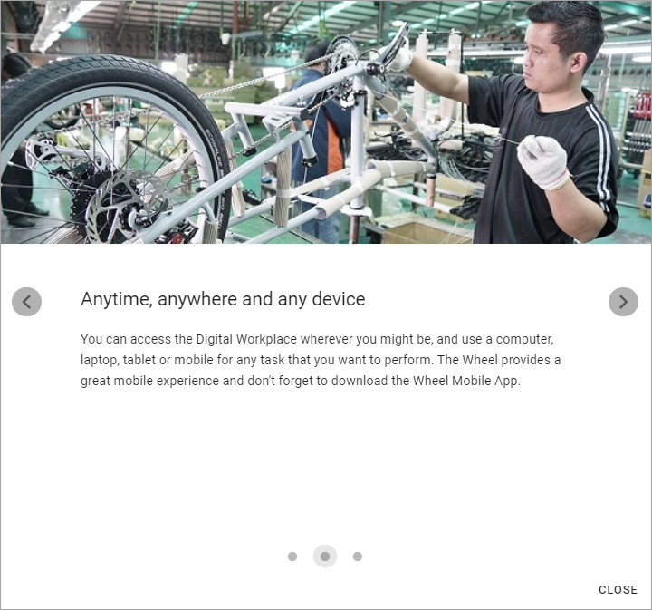

Tutorial implementation example
==============================================

**These page is being updated. Will be finished soon.**

This example consists of three steps:

.. image:: tutorial-example-1-new.png

These settings has been made for the first step:

.. image:: tutorial-example-2-new.png

and these settings for the second step:

.. image:: tutorial-example-3-new.png

and these for the third:

.. image:: tutorial-example-4-new.png

The tutorial is targeted to just one page and will start automatically:

In the Header for Workspace, for the Business Profile, it has been set that tutorials should be available in the Action Menu. The icon is shown where a tutorial is available, but not shown otherwise.

"Pinned" means shown as an icon. Another option is to make tutorials available in the menu, as you can see has been set for Omnia Admin and Strenghten Profile in this example.

The user experience:

The steps will be shown for users this way:

.. image:: tutorial-example-7.png

.. image:: tutorial-example-9.png

Users can navigate the tutorial using the dots or the arrows:

.. image:: tutorial-example-10.png

In this example, the tutorial starts automatically the first time the user enters the page, but after that it can be started using the Tutorial icon:

.. image:: tutorial-example-11.png

If the Header settings for the Workspace had been "Menu":

.. image:: tutorial-example-12.png

no icon would have been shown and the tutorial would have been available in the menu instead:

.. image:: tutorial-example-13.png
