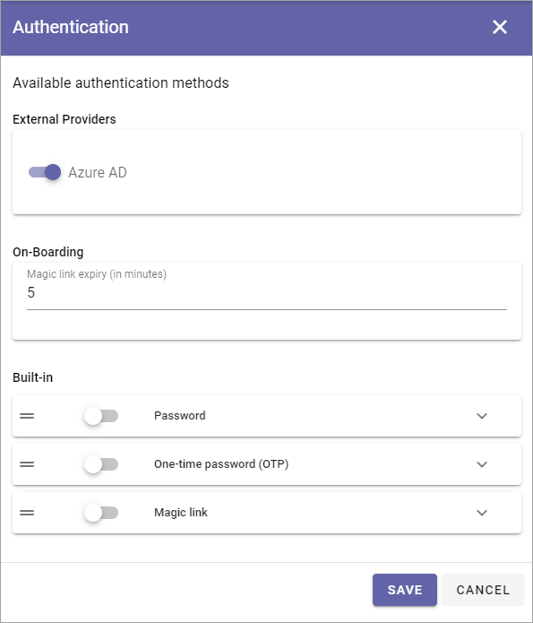

Authentication - tenant settings
=============================================

This option is available in Omnia 7.0 and 7.1.

The options for authentication is a bit different in Omnia 7.5, and is now found in the User management settings for the a business profile. See this page for more information: :doc:`User Management - business profile </admin-settings/business-group-settings/user-management-bp/index>`

Omnia supports any custom authentication provider to be plugged into the system. Built-in authentication providers are Azure AD, Active Directory (for Omnia on-prem) and Omnia. Omnia provides support for a range of authentication options, including passwords, one-time passwords (OTPs), magic links, and combinations of these methods.

A "Magic link" is simply a one time link.

