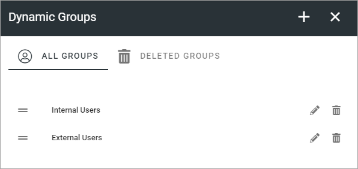
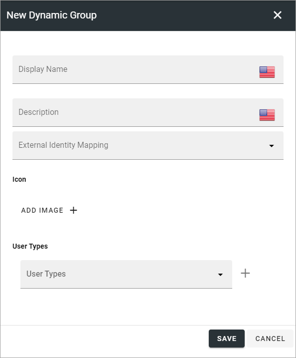
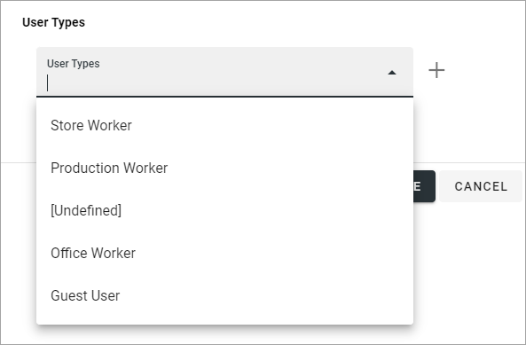
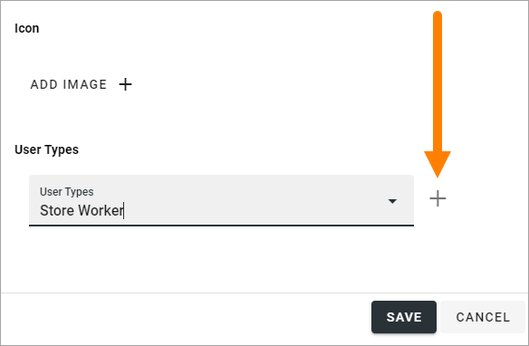
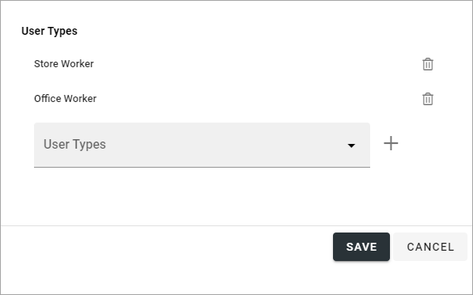
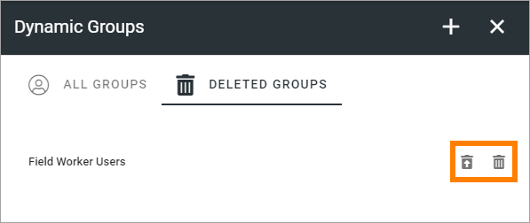

Dynamic Groups
=============================================

This option is available in Omnia 7.0 and later.

Here dynamic groups can be created, edited and deleted. Dynamic security groups are based on user types, not on membership. They will replace and expand on the built-in groups “Internal users” and “External users” and can be used to protect information.

The user types are those created in User Management, see: :doc:`User Types </admin-settings/tenant-settings/user-management/user-types/index>`

Use the pen to edit settings for a group, the dust bin to delete it.

Create a new dynamic group
-------------------------------
The settings you can use for a new dynamic group are these:

Available properties in the first part depends on properties set up in User Management. 

+ **ADD IMAGE**: if you would like to add an image for the group, click this button and use the Media picker to select image.
+ **User Types**: Use this list to select user type(s), see below.

Add user types to a group
---------------------------
To add a user type to a group, open the list and select a group.

Then click the plus.

Repeat until all user types you want in this group are added.

If you added a user type by mistake, just click the dust bin to delete it.

Save your changes when you're done.

Deleted groups
****************
In the list of deleted dynamic groups, you can restore or permanently delete a group by using the icons:

