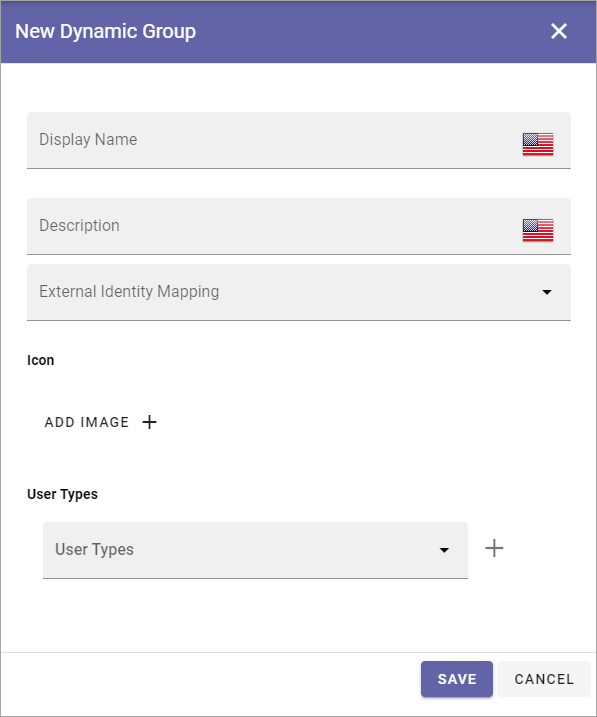

Dynamic Groups
=============================================

This is an upcoming Omnia 7.0 option.

**Work on the documentation has just started.**

Here dynamic groups can be created, edited and deleted. Dynamic security groups are based on user types. They will replace and expand on the built-in groups “Internal users” and “External users”.

.. image:: dynamic-groups-list.png

The settings you can use for a dynamic group are these:

