Groups
=============================================

Here, all groups in the tenant are listed and you can create and delete your own Omnia groups for security setups.

If you're working with User management for a business profile, groups can be created and edited the same way there, and is then valid for that business group only.

All groups
*************
A list of all groups can look like this:

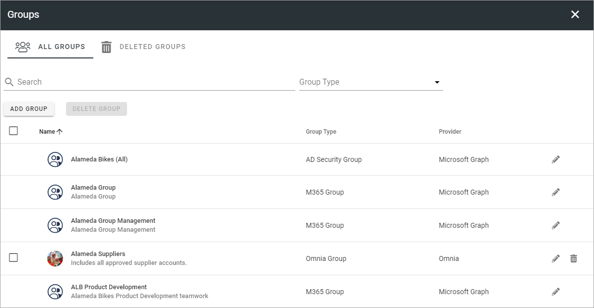

To edit the settings for a group, click the pen. To delete it, click the dust bin. When you edit an Omnia group, all settings are available, as when you add a new group, see below. Regarding groups and users from MS Graph, only added properties, if any, can be edited, not the information that originates from MS Graph.

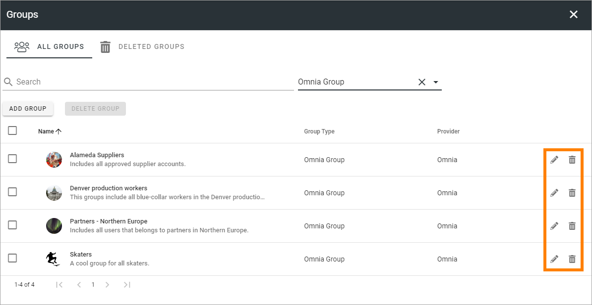

Note that you can search and filter on "Group type". If you would like a list of the Omnia groups only, select "Omnia group" as group type.

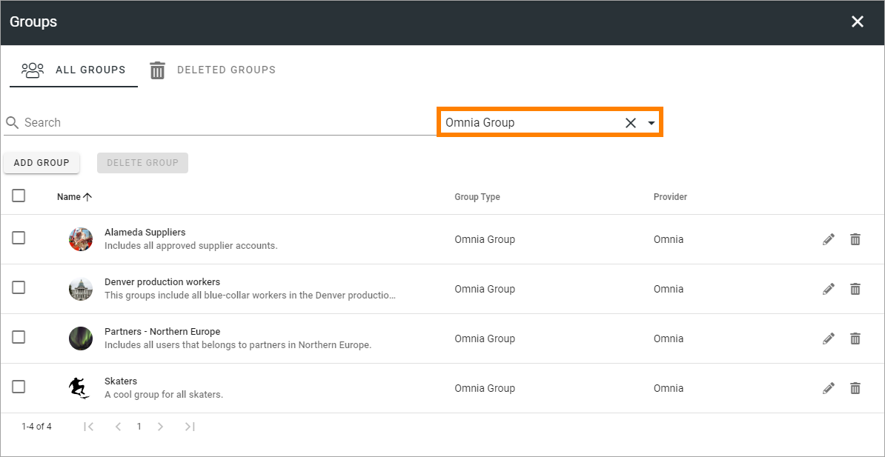

If you would like to list the users from one business profile only, use the filter Owner and add the name of the business profile.

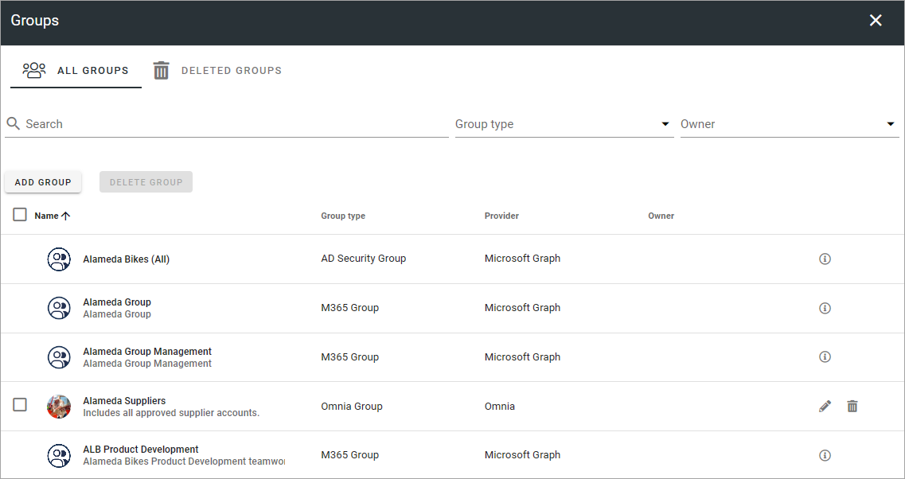

Also note that you can use the i-icon for information about other groups than Omnia groups.

Add a new group
----------------
Click the ADD GROUP button to create a new Omnia group, and use these settings:

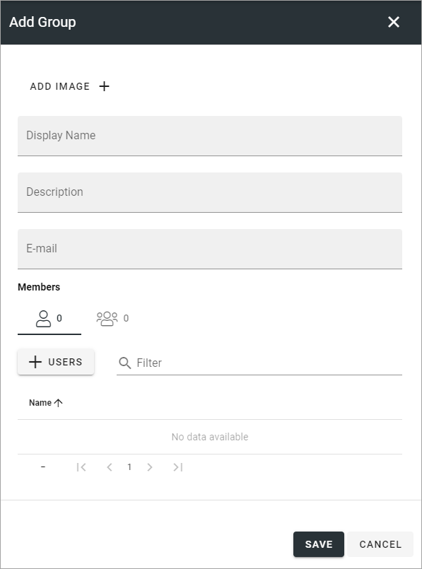

Here you can add an image for the group using the Image picker, add a name and description and add Omnia users to the group. The users must be added to the Users list first, see this page for more information: :doc:`Users </admin-settings/tenant-settings/user-management/users/index>`

Add users to a group
---------------------------------
For 7.5 it worls this way: Only Omnia users can be added to Omnia groups. If you need to add other users to groups, use Dynamic groups.

In Omnia 7.6 and later Entra ID users can be added to a group as well.

To add users to a group, do the following:

1. Click the USERS button and add one or more users from the list.

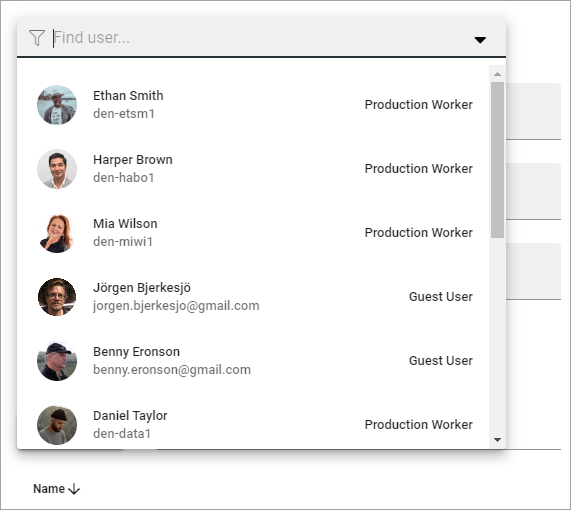

The added users are now shown. You an use the pen to edit the user's settings and the dust bin to remove the user from th group.

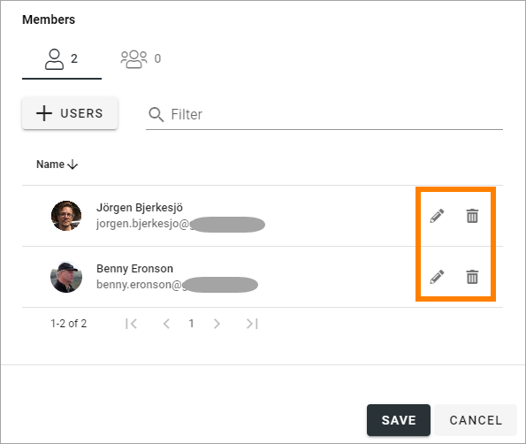

The filter can be used to find one or more users in a long list.

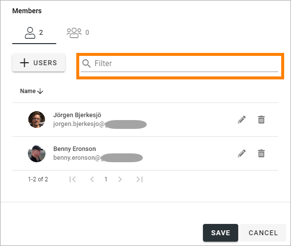

Add groups to an Omnia group
------------------------------
Only Omnia groups can be added to Omnia groups. If you need to add other groups, use Dynamic groups. 

1. Click the Groups icon.

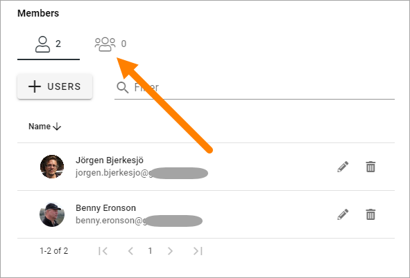

2. Click the GROUPS button and add one or more groups from the list.

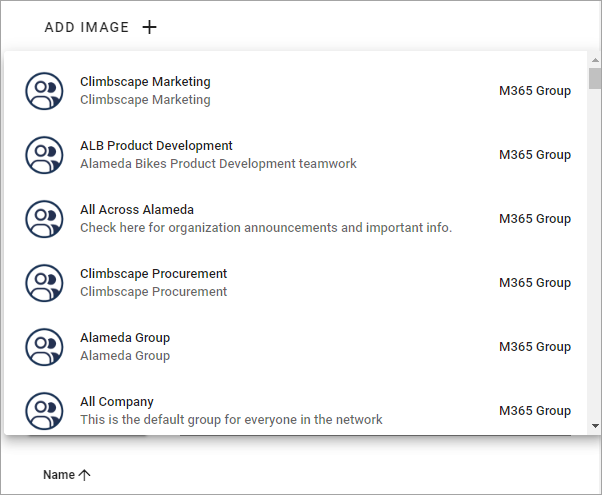

The added groups are now shown. You an use the pen to edit the groups's settings, if it's an Omnia group, or check the group's settings if it's another type if group. Use the dust bin to remove the group from the group.

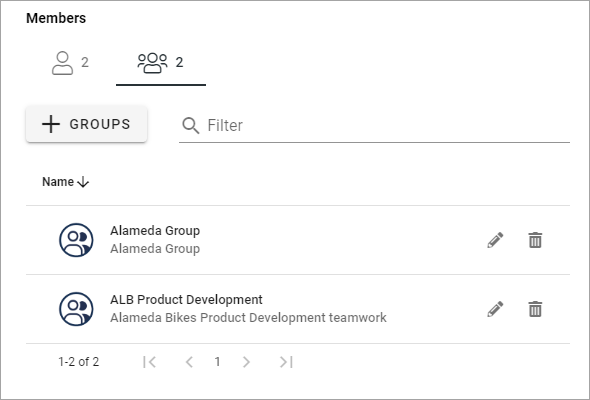

The filter can be used to find one or more groups in a long list.

Deleted groups
****************
In the list of deleted groups you can restore deleted groups or delete them permanently.

