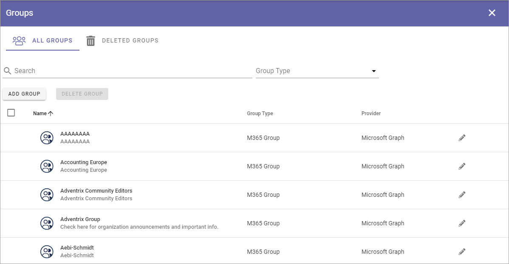
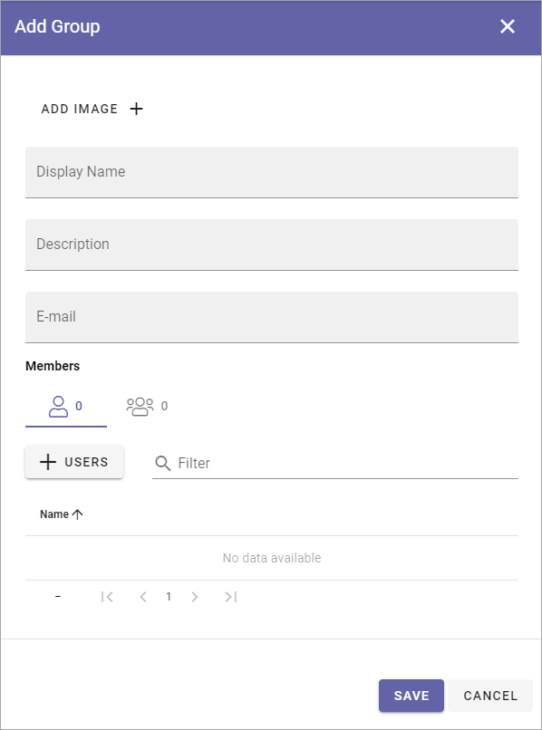

Groups
=============================================

This is an upcoming Omnia 7.0 option.

**Work on the documentation has just started.**

Here, the groups in the tenant are listed and you can create and delete your own Omnia Groups.

All groups
*************
A list of groups can look like this:

Note that you can search and filter on Group Type.

Add a new group
----------------
Click the ADD GROUP button to create a new Omnia only group, and use these settings:

Here you can add an image for the group using the Image pickerm add name and description and add Omnia only users to the group. The users must be added to the Users list first.

Deleted groups
****************
In the list of deleted groups you can restore groups or delete them pemanently.

