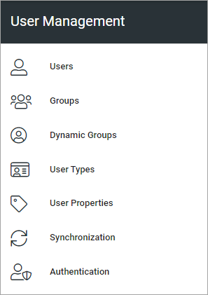

User Management
=============================================

User Management is an all new option in Omnia 7.0. Here you can add and handle users that does not require an Microsoft 365 licens, and some other options.

**Work on the documentation has just started.**

Select option below for more information.

.. toctree::
   :titlesonly:

   users/index
   group/index
   dynamic-groups/index
   user-types/index
   user-properties/index
   synchronization/index
   authentication/index

