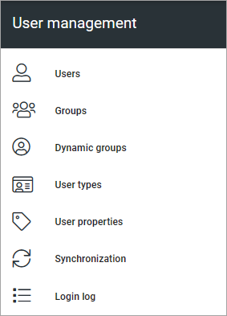

User management - tenant settings
=============================================

User management is available in Omnia 7.0 and later. Here you can add and handle users that does not require an Microsoft 365 license, and some other options. (Image from Omnia 7.5)

In Omnia 7.5, Omnia users can be set up for a business profile only, see (ongoing documentation): :doc:`User management - business profile </admin-settings/business-group-settings/user-management-bp/index>`

Select option below for more information.

.. toctree::
   :titlesonly:

   users/index
   groups/index
   dynamic-groups/index
   user-types/index
   user-properties/index
   synchronization/index
   authentication/index
   login-log/index

