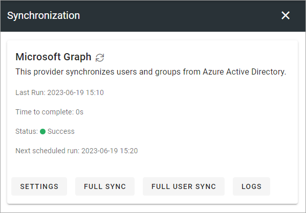

Synchronization
=============================================

Identity and user details sync from Azure Active Directory are done here in Omnia 7.0 and later. In Omnia 7.5 you can also synchronize users and groups to Omnia search.

Omnia supports any custom user directory provider to synchronize groups and users into the system. Built-in providers are Microsoft Graph (Azure AD) and Active Directory for Omnia on-prem.

**Note!** If mapping is needed, it's important that you set this up using the settings before synchronizing.

For Omnia search sync, a button for full sync and for reading logs are available:

.. image:: user-management-sync-omnia search.png

(More information about this option will be added soon.)

SETTINGS
**********
Available settings will differ depending on directory provider. These settings are available for Microsoft Graph:

.. image:: user-management-sync-settings.png

If you need additional mapping, just select properties from the lists and click the plus.

Note that rules for different user types can be set up.

FULL SYNC or FULL USER SYNC
*****************************
FULL SYNC syncs all properties for all users and groups. FULL USER SYNC syncs all properties for all users, but not for the groups.

