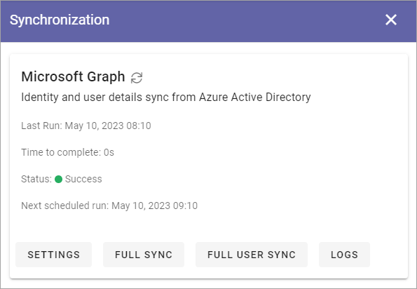

Synchronization
=============================================

This option is available in Omnia 7.0 and later.

**Work on the documentation has just started.**

Identity and user details sync from Azure Active Directory are done here in Omnia 7.0.

Omnia supports any custom user directory provider to synchronize groups and users into the system. Built-in providers are Microsoft Graph (Azure AD) and Active Directory for On-prem.

