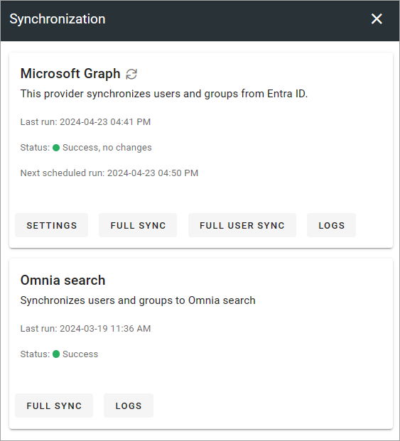
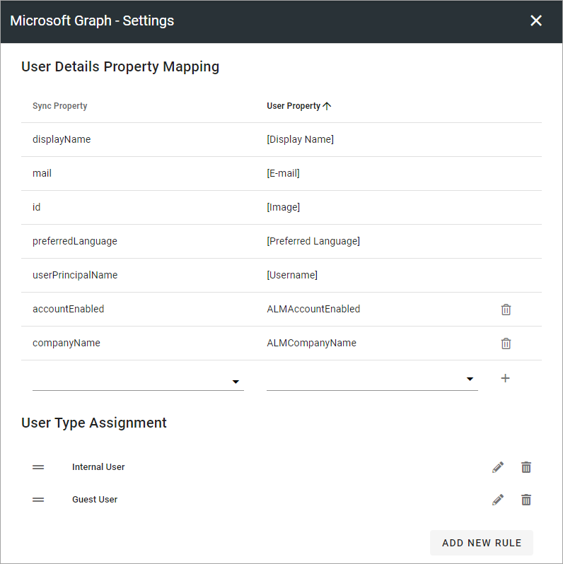

Synchronization
=============================================

Identity and user details sync from Entra ID are done here. You can also synchronize users and groups to Omnia search, if needed.

Omnia supports any custom user directory provider to synchronize groups and users into the system. Built-in providers are Microsoft Graph and Active Directory for Omnia on-prem.

**Note!** If mapping is needed, it's important that you set this up using the settings before synchronizing.

For Omnia search sync, a button for full sync and for reading logs are available.

Omnia search sync is normally fully automatic, nothing you should need to do manually.

SETTINGS
**********
Available settings will differ depending on directory provider. These settings are available for Microsoft Graph:

If you need additional mapping, just select properties from the lists and click the plus.

**Note!** It's very important that you set up rules for user types, as a user that doesn't match any such rules will have an "Undefined" user group and are not, for example, available in people picker lists. On the other hand, accounts that are not users (for example system accounts) should be "Undefined" according to the rules set up, as they should not appear in people picker lists.

FULL SYNC or FULL USER SYNC
*****************************
FULL SYNC syncs all properties for all users and groups. FULL USER SYNC syncs all properties for all users, but not for the groups.

