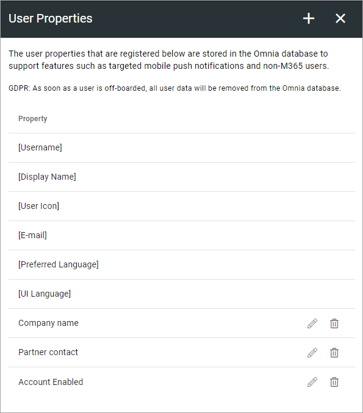
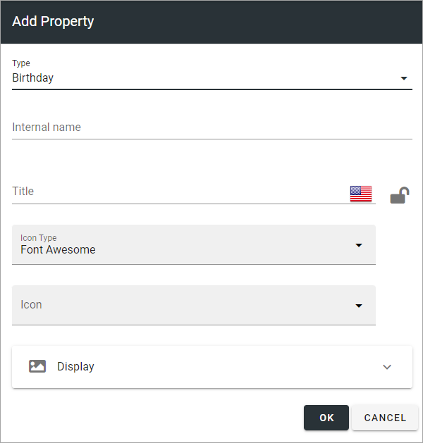
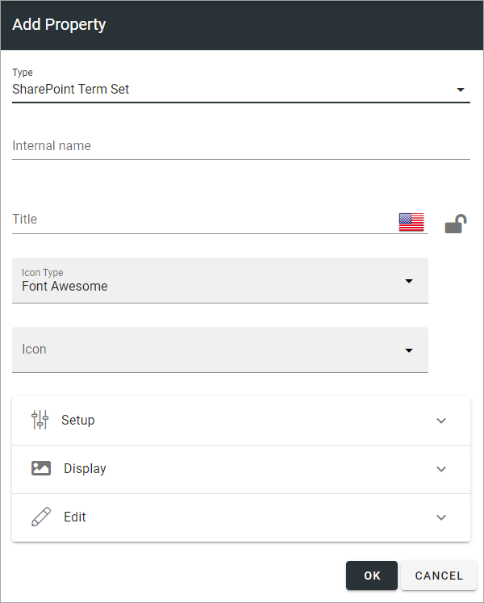
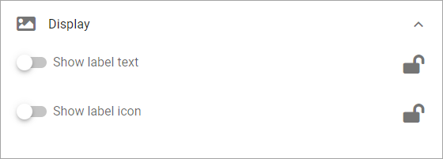
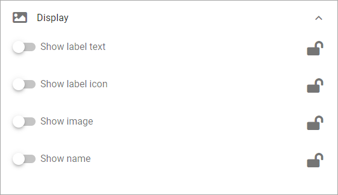

User Properties
=============================================

This option is available in Omnia 7.0 and later.

**This documentation is ongoing. More info will be added soon.**

The properties you want to use when creating Omnia users must be added here. These properties can also be shown on the customized user profile cards together with properties from Azure AD and SharePoint. Besides that, they will also be used to manage targeted mobile push notifications and statistics. Also note the comment about GDPR.

When adding a new property, the following settings are available:

The list of options at the bottom will differ depending on type of property. For more information, see below.

Setup and Edit can be also be available, as here for Sharepoint Term set.

Display
---------
Display options are present for most property types, except for Process. For most properties you can choose to display label text and label icon.

Additionally, for type Identity you can choose to display image and name as well.

Edit
------
These types have Edit options: 

+ HTML - you can choose to display the edit options; Rich Text, Limited Rich Tect or Custom Rich Text.
+ Image - you can set default scaling, decide which crop ratios that should be available and decide to force default scaling.
+ Sharepoint Term Set - you can choose to allow multi value.

Setup
-------
Available for type Sharepoint Term Set only. (A description will be added soon).
