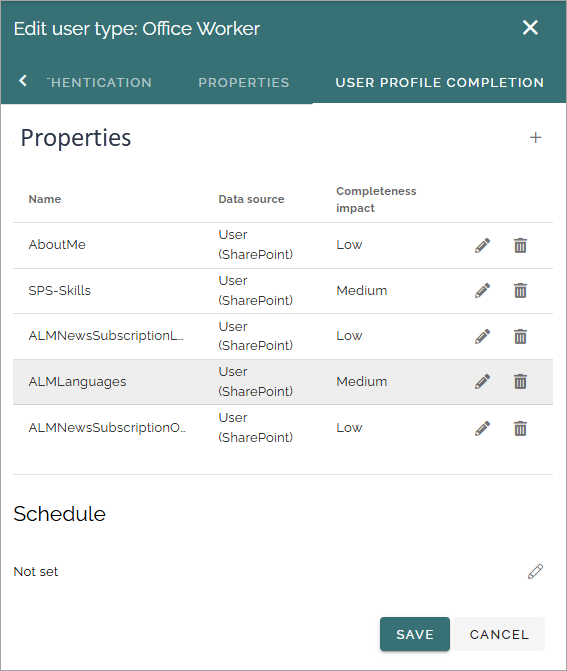
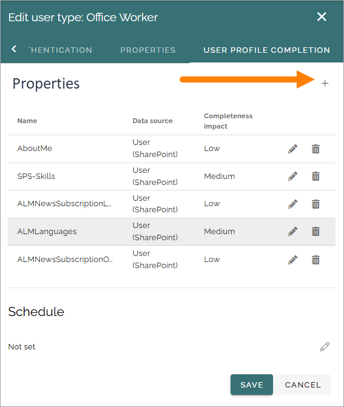
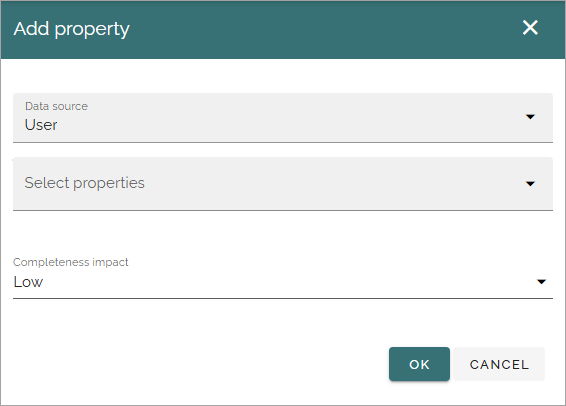
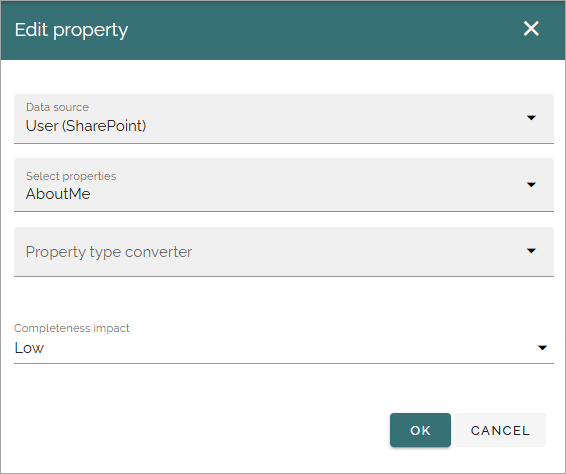
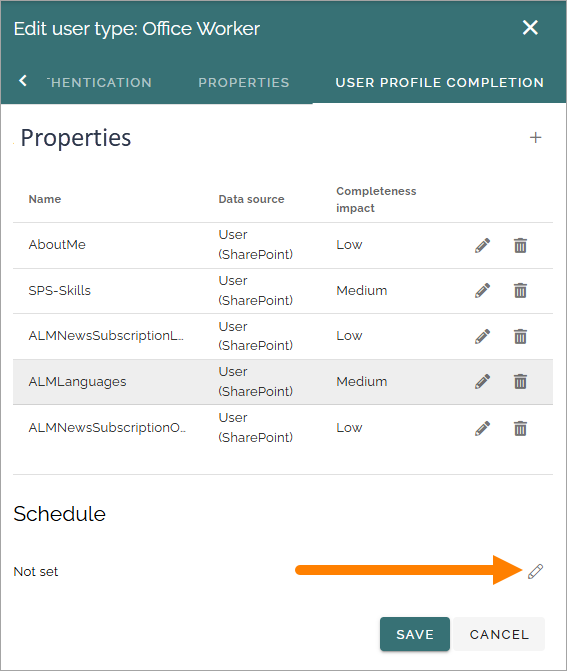
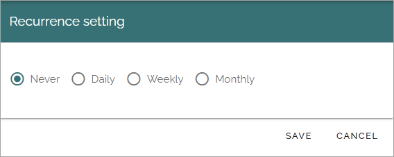
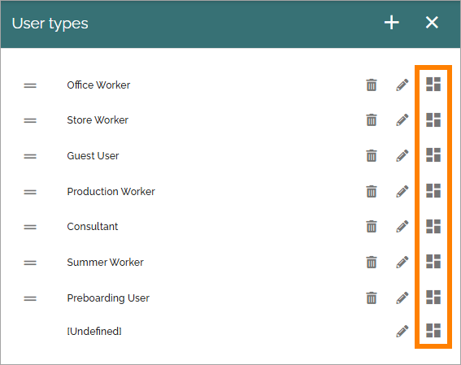

User types
=============================================

All users in Omnia will be assigned a user type. User types are also used when creating Omnia users and when setting up dynamic groups. It's also possible to create customized user profile cards for different user types.

Authentication settings are set per user type. See below for more information.

In Omnia 7.7 and later, settings for user profile completion is also done per user type. See below for more information.

If any user types for Omnia users has been set up so far, they are listed here, for example:

.. image:: user-management-types-new.png

Use the dust bin to delete a user type, the pen to edit and the third icon to create a customized user profile card, if needed.

These settings can be used when creating a new user type:

.. image:: user-management-types-settings-new.png

As you can see, the name and description can be added in any tenant language. 

Authentication
****************
Here you can set the following:

.. image:: user-management-types-auth.png

+ **External providers**: If there are more than one provider, make sure to select the correct one.
+ **Onboarding**: Set the expiration time for the one-time link and add the URL to the onboardring page, if needed.
+ **Built-in**: Select the authentication you want to use for this user type and expand the option for more options, see below.
+ **Refresh token expiration**: Set the number of days that can pass until a user is forced to log in again.
+ **INVALIDATE ALL USER TOKENS**: When permissions for Omnia has been changed, users needs to log out and log in for the changes to take effect. You can click this button to force a log out from Omnia for all users. Important information on this below.

When expanding one of the options for "Built-in", additional settings are available, for example:

.. image:: user-management-types-auth-more.png

If "Two-factor authentication" is selected, the following must also be set:

.. image:: user-management-types-auth-more-two.png

You must select select one of the other authentication methods available, as the second authentication.

More on Invalidate all user tokens
------------------------------------
If the button INVALIDATE ALL USER TOKENS is clicked to force a log out from Omnia for all users, only Omnia is affected, not Sharepoint, Office apps, mail or anything else outside Omnia.

If an editor or author is working on a page in Omnia, the user will be logged out but content added to a page, even if it's not published, is automatically saved quite often, to minimize content lost.

Properties
*************
On the Properties tab, something like the following is available:

.. image:: user-management-types-prop.png

Here you decide which properties should be available for this user type. A few properties are mandatory and can not be deselected, they are marked with gray.

User profile completion
*****************************
This is a new tab in Omnia 7.7. User profile completion can work quite differently in Omnia 7.7 and later. All can now be done through the user profile card. On this tab you work with the settings for profile completion. (The previous, classic, functionality for profile completion is also available).

The selected properties are listed here (in a new user type, this list is empty). Use the pen to edit the settings and the dust bin to remove a property from the list. Of course, these properties must also be present in the card layout for the follow up on profile completion to be meaningful.

Add a property
----------------
To add a property to this list, do the following:

1. Click the plus.

The following settings are available:

+ **Data source**: Select the data source to get the properties from; User (meaning Omnia user), User (Microsoft Graph) or User (Sharepoint). 
+ **Select properties**: Select the property here.
+ **Completeness impact**: You can set the completeness impact to Low, Medium or High.

When editing the settings for a property (using the pen), an additional setting is available:

+ **Property type converter**: If needed, this option is shown. Use it to select property type to use for the selected property. Several properties can for example be either Text or Multi-value text, but that’s just one simple example.

Schedule
------------
You can schedule the check for how complete the user profle is, according to the settings for the user type. Click the pen to set or to change the setting:

You can set the schedule to Never (meaning not set), Daily, Weekly or Monthly. 

Create a custom user profile card
************************************
You can create a custom user profile card for each user user type if needed, and you can create different layouts for private card view and public card view. A private card view is simply when a user looks at his or her own card, a public card view is what everyone else can see. In Omnia 7.7 and later, the private view of the card can be used to edit the information shown on the public view. 

To work with the user profile card layout, click this icon:

You work with the layout for the cards the same way as other layouts in Omnia, see: :doc:`Working with layouts </general-assets/working-with-layouts/index>`

Of course, just a few of the available blocks makes sense to use here, but that is up to you.

Here's an example of a user profile card layout (shown in edit mode):

.. image:: user-card-layout.png

At the top, a User information block is added. Next, a Tab section is added, for navigation purposes, for three tabs with information. The first tab is a Properties block (Contact), the second is an Organization tree block, and the third (Experience) is a Properties block.

For more information about the blocks, see: 

+ :doc:`The User information block </blocks/user-information-block/index>`
+ :doc:`The Properties block </blocks/properties-block/index>`
+ :doc:`The Organization tree block </blocks/organization-tree/index>`

Preview a profile card
---------------------------
You can preview the card layout for different users:

.. image:: user-card-layout-user.png

**Important note!** When you preview a colleagues card, all permissions are valid, meaning you can just see what YOU have permissions to see, not what the user has permissions for.

