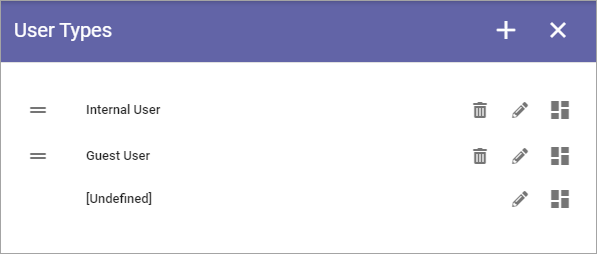
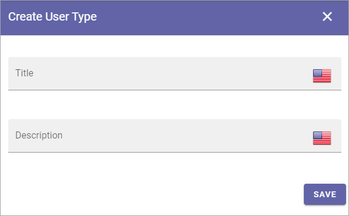

User Types
=============================================

This is an upcoming Omnia 7.0 option.

**Work on the documentation has just started.**

User types can be used in the lits of Omnia only users. 

If any user types has been set up thus far,, they are listed here, for example:

These setting can be used when creatin a new user type:

