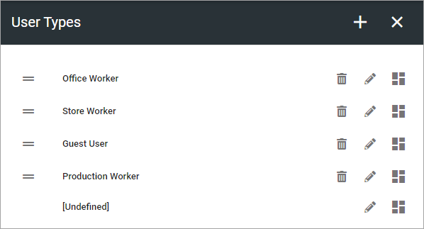
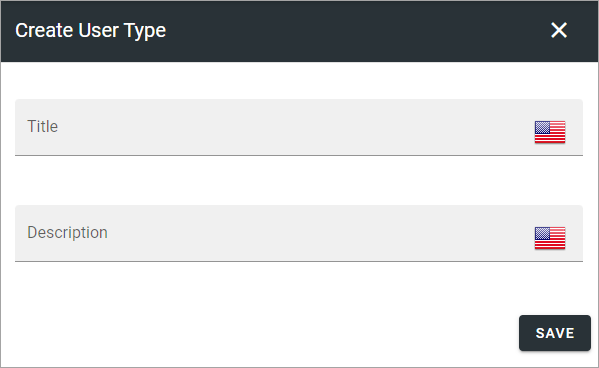
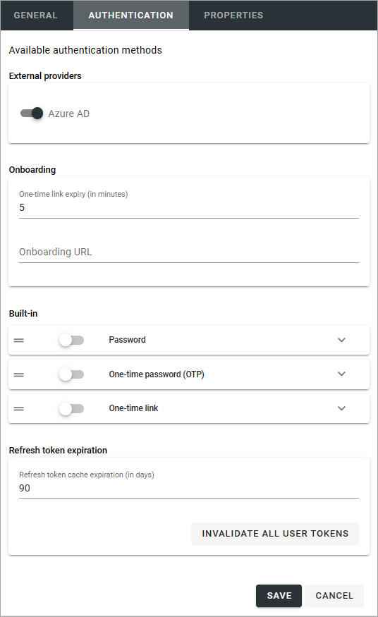
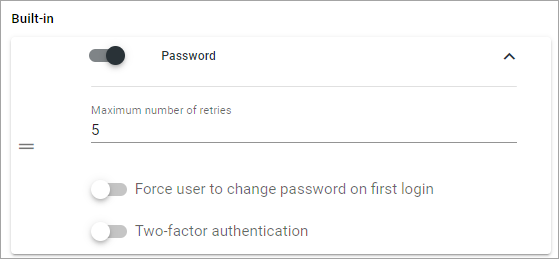
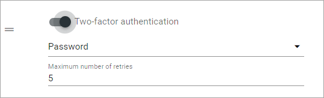
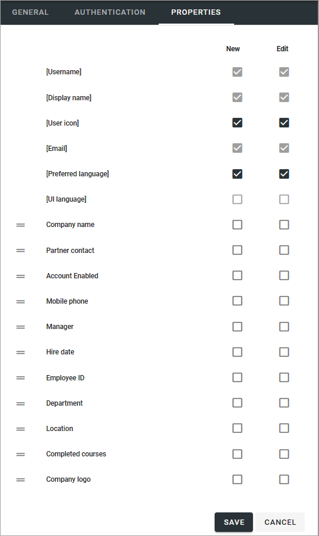
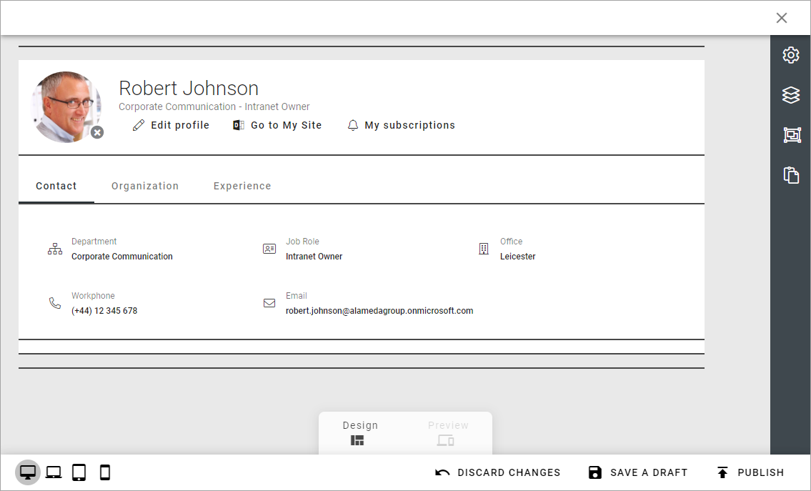
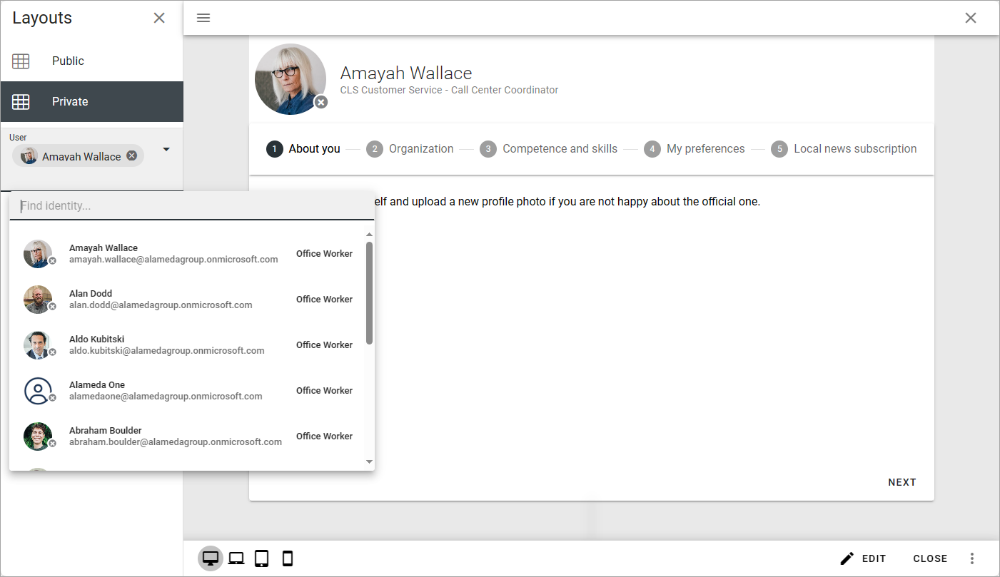

User types
=============================================

This option is available in Omnia 7.0 and later.

All users in Omnia will be assigned a user type. User types are also used when creating Omnia users and when setting up dynamic groups. It's also possible to create customized user profile cards for different user types.

**Important note!** In Omnia 7.5 authentication settings are set per user type. See below for more information.

If any user types for Omnia users has been set up so far, they are listed here, for example:

Use the dust bin to delete a user type, the pen to edit and the third icon to create a customized user profile card, if needed.

These settings can be used when creating a new user type:

As you can see, the name and description can be added in any tenant language. 

Additions in Omnia 7.5
*************************
In Omnia 7.5 you can also set authentication method and add properties to a user type.

Authentication
-----------------
Here ypu can set the following:

+ **External providers**: If there are more than one provider, make sure to select the correct one.
+ **Onboarding**: Set the expirt time for the one-time link and add the URL to the onboardring page, if needed.
+ **Built-in**: Select the the authentication you want to use for this user type and expand the option for more options, see below.
+ **Refresh token expiration**: (A description will be added soon).
+ **INVALIDATE ALL USER TOKENS**:  When permissions for Omnia has been changed, users needs to log out and log in for the changes to take effect. You can click this button to force a log out from Omnia for all users. Important information on this below.

When expanding one of the options for "Built-in", additional settings are available, for example:

If "Two-factor authentication" is selected, the following must also be set:

The first step is to select one of the other authentication methods available, as the second autehnticaiton.

On the Properties tab, something like the following is available:

Here you decide which properties should be available for this user type. A few properties are mandatory and can not be deselected, they are marked with gray.

More on Invalidate all user tokens
---------------------------------------
If the button INVALIDATE ALL USER TOKENS is clicked to force a log out from Omnia for all users, only Omnia is affected, not Sharepoint, Office apps, mail or anything else outside Omnia.

If an editor or author is working on a page in Omnia, the user will be logged out but content added to a page, even if it's not published, is automatically saved quite often, to minimize content lost.

Create a custom user profile card
************************************
You can create a custom user profile card for each user group if needed, and you create different layouts for private cards and public cards. A private custom user profile card is simply when a user looks at his or her own card, a public card is what everyone else can see.

You work with the layout for the cards the same way as other layouts in Omnia, see: :doc:`Working with layouts </general-assets/working-with-layouts/index>`

Of course, just a few of the available blocks makes sense to use here, but that is up to you.

Here's an example of a user profile card layout (shown in edit mode):

At the top, a User information block is added. Next, a Tab section is added, for navigation purposes, for three tabs with information. The first tab is a Properties block (Contact), the second is an Organization tree block, and the third (Experience) is a Properties block.

For more information about the blocks, see: 

+ :doc:`The User information block </blocks/user-information-block/index>`
+ :doc:`The Properties block </blocks/properties-block/index>`
+ :doc:`The Organization tree block </blocks/organization-tree/index>`

As an addition in Omnia 7.5 you can now preview the card layout for different users:

