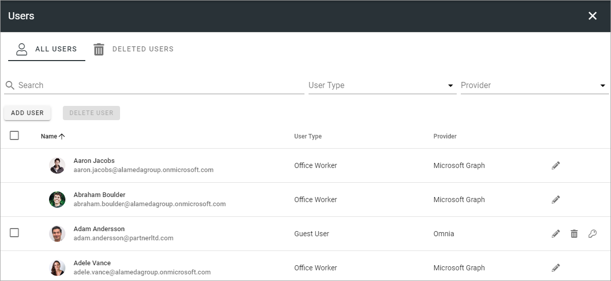
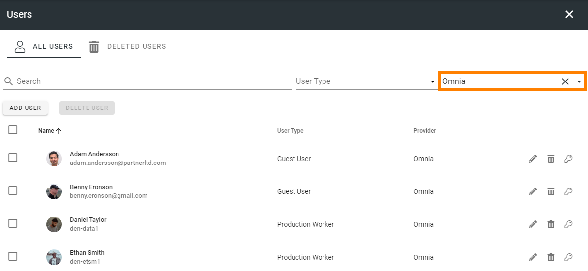
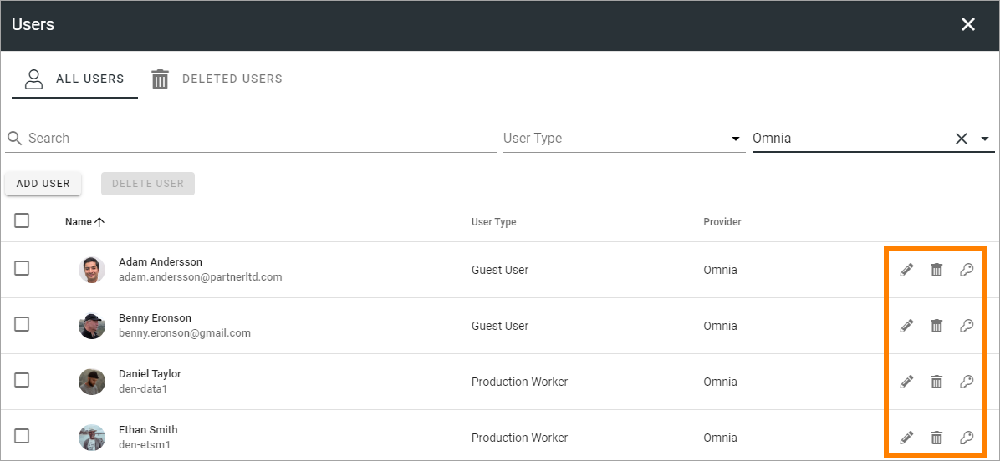
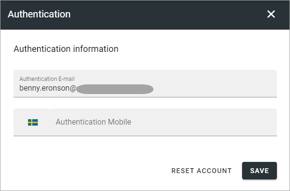
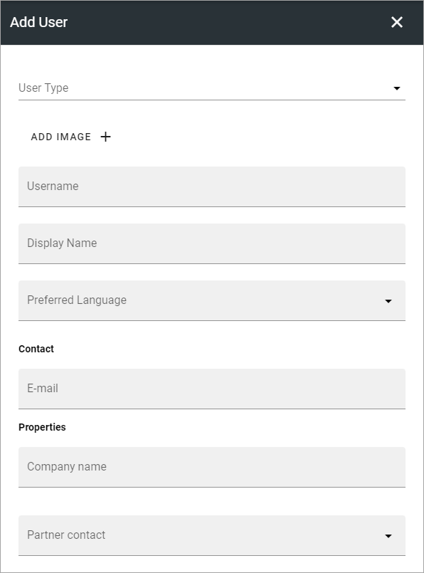
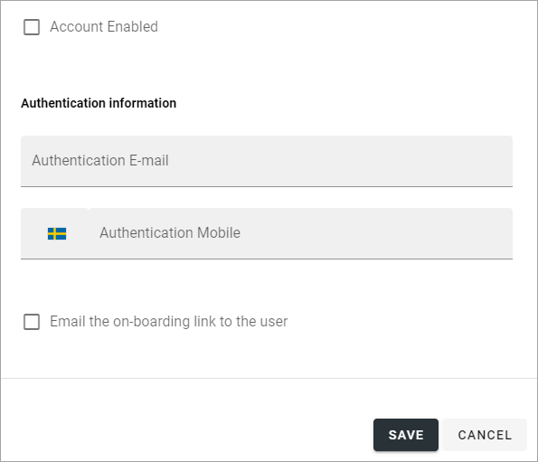
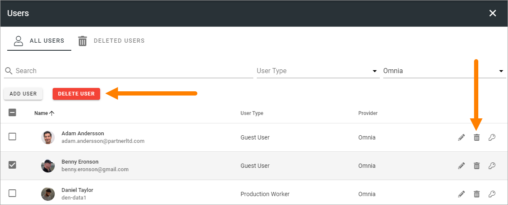
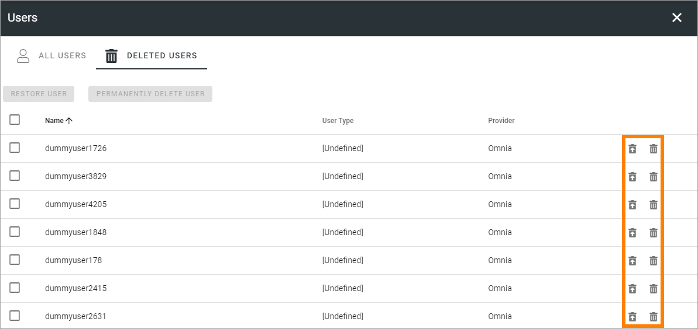
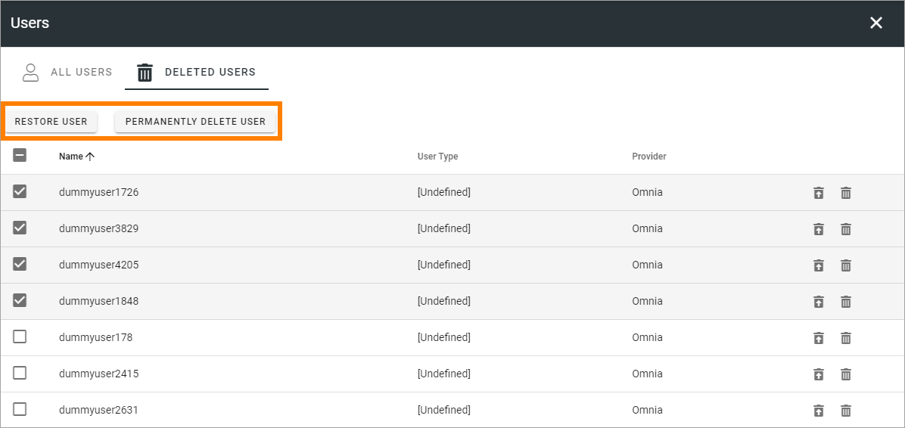

Users
=============================================

This is option is available in Omnia 7.0 and later.

Two lists are available here; ALL USERS and DELETED USERS.

All users
************
In the ALL USERS list, all users in the tenant are listed. Here you can add Omnia users - users tha does not require a Microsoft 365 licence, and delete users you have added this way.

Note that you can use the search field to find a user and filter the list on "User Type" and "Provider". If you would like to list Omnia users created here, select "Omnia" for "Provider".

A few settings are available for Omnia users; use the pen to edit User Type, the key for authentication settings (see below) and the dust bin to delete the user.

Using the pen, all settings for user (see below), except authentication settings, can be edited.

To edit authentication settings, click the key, and the following is available:

Save the changes when you're finished.

If you need to reinitiate the whole onboarding process for the user, click RESET ACCOUNT.

About limitations for Omnia users
-----------------------------------
As mentioned, Omnia users does not require a Microsoft 365 licence, but that means no options that are depending on Sharepoint can be used. That includes, for example Teams functionality, teamworks, Document Management, Process Management.  

Add a new Omnia only user
-----------------------------
To add a new user, click the ADD USER button.

.. image:: user-management-users-add-button-new.png

Available fields are the properties set up under the option in the User Management menu. Here's an example:

and these:

The following options are always available:

+ **User Type**: Select user type in the list. User types that should be available here must be set up using the option in the User Management menu.
+ **ADD IMAGE**: To add an image of the user, click here and use the Media picker to find the image.
+ **Account Enabled**: When this user should be activated, select this option.
+ **Authentication information**: Add an authentication e-mail. This is mandatory. If needed, enter a  phone number for mobile authentication.
+ **Send on-boarding link by e-mail to user**: You can chosse to send an on-boarding e-mail to the user by selecting this option. The e-mail is sent when the user is saved.

Delete a user
--------------
To delete one or more Omnia users, do the following:

1. Select the user/users.
2. Click the DELETE USER button that has become available, or click the dust bin for a single user.

The DELETED USERS list
***********************
You can use this list to restore deleted Omnia users or delete users permanently. To restore or pemanently delete a single user, use the buttons at the right of the user's row.

To restore or permanently delete a number of users, select them first and use the buttons at the top:

