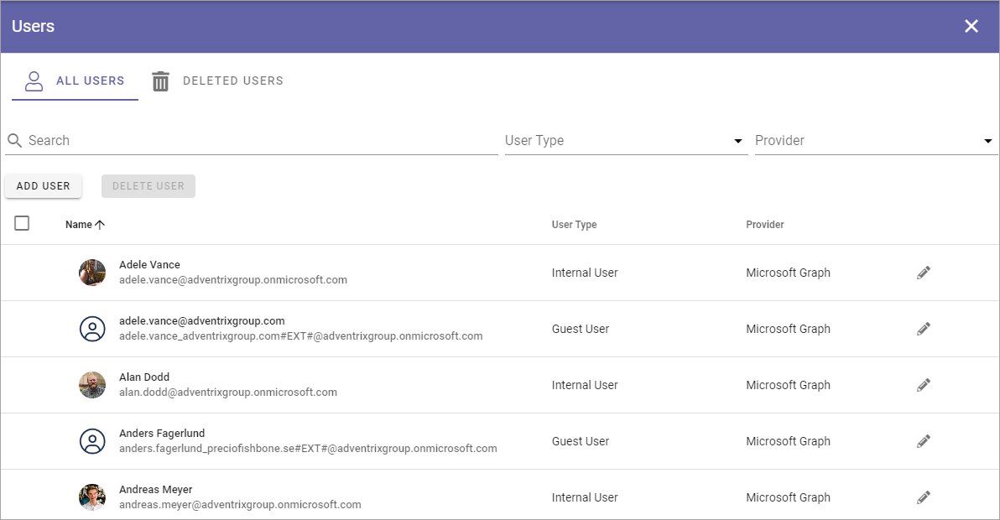
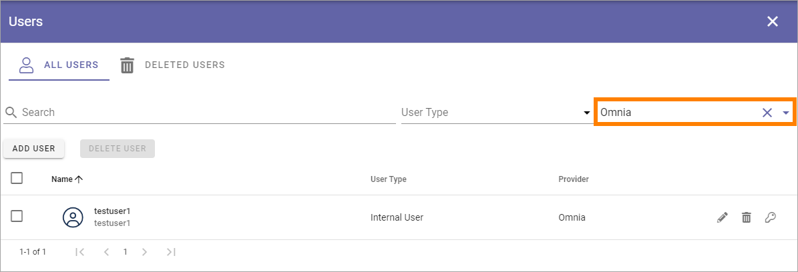
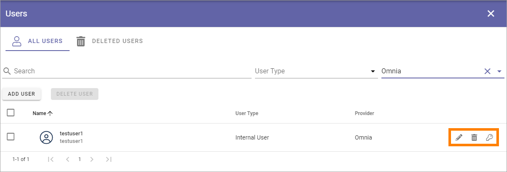
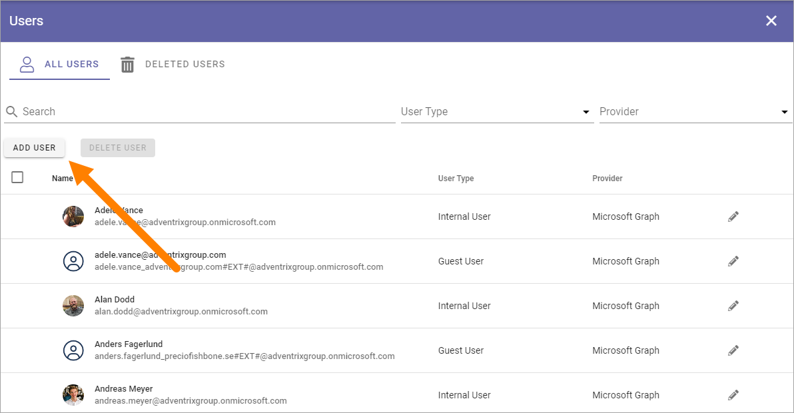
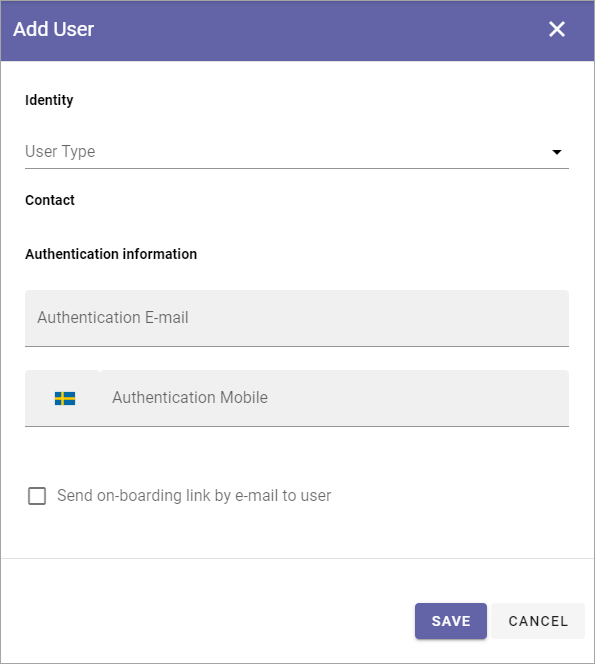
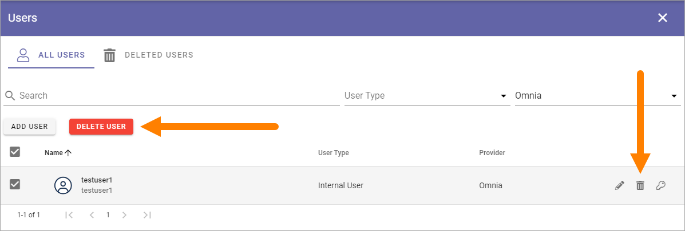
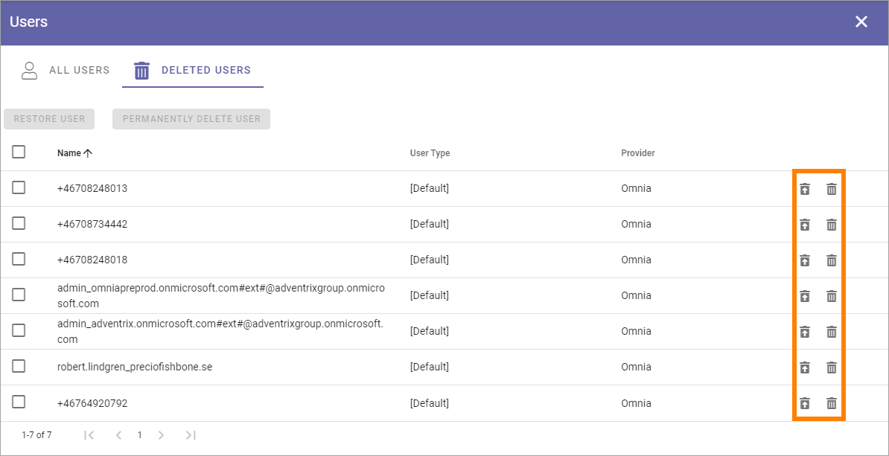
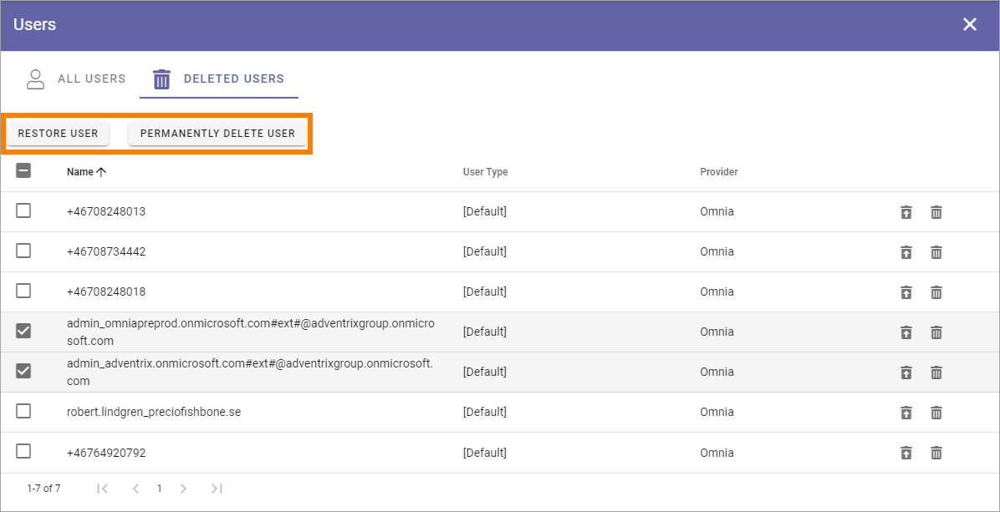

Users
=============================================

This is an upcoming Omnia 7.0 option.

**Work on the documentation has just started.**

Two lists are available here; ALL USERS and DELETED USERS.

All users
************
In the ALL USERS list, all users in the tenant are listed. Here you can add non-Microsoft 365, Omnia only users and delete users you have added this way.

Note that you can filter the list on "User Type" and "Provider". If you would like to list only Omnia users created here, select "Omnia" for "Provider".

A few settings are available for Omnia only users; use the pen to edit User Type, the key for authentication settings (see below) and the dust bin to delete the user.

Add a new Omnia only user
-----------------------------
To add a new user, click the ADD USER button.

Use the following settings:

+ **User Type**: Select user type in the list. 
+ **Authentication information**: Add an authentication e-mail. This is mandatory. If needed, enter a  phone number for mobile authentication.
+ **Send on-boarding link by e-mail to user**: You can chosse to send an on-boarding e-mail to the user by selecting this option.

Delete a user
--------------
To delete one or more Omnia only users, do the following:

1. Select the user/users.
2. Click the DELETE USER button that has become available, or click the dust bin for a single user.

The DELETED USERS list
***********************
You can use this list to restore deleted Omnia only users or delete users permanently. To restore or pemanently delete a single user, use the buttons at the right row.

To restore or permanently delete a number of users, select the first and use the buttons at the top 

