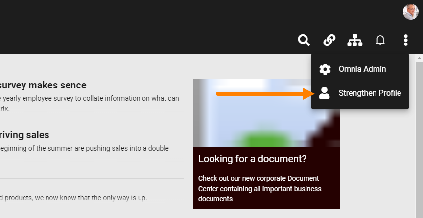
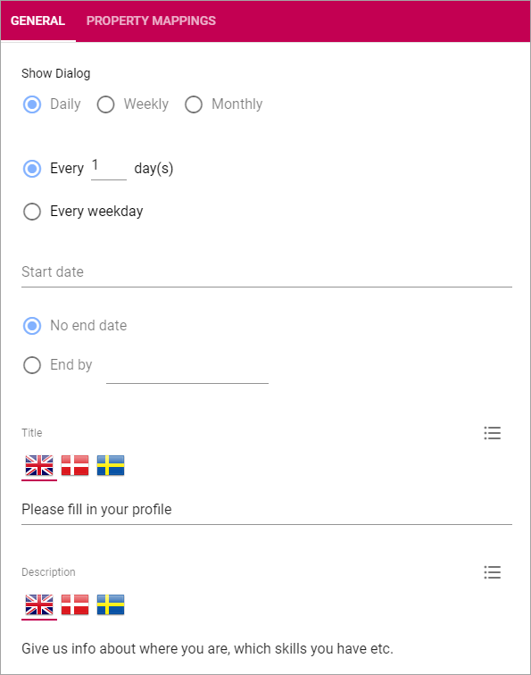
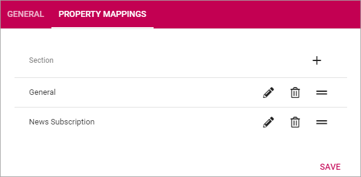

User Profile Completion
=========================

This is the settings for the user option "Strengthen Profile", found inte the Action Menu.

The settings
**************

The following settings are available:

General
--------
Here you can set these settings:

+ **Show Dialog**: Decide how often the Dialog should be shown for a user. First set "Daily", "Weekly" or "Monthly" and then set details if needed.
+ **Start date**: Click in the field and use the calendar to select start date for the Dialog's first appearance.
+ **No end date/End by**: Select when the Dialog should no more be shown; never ("No end date") or click in the "End by" field and use the calendar to set a date.
+ **Title**: Use this field to enter a Title for the Dialog. Click the list icon to add Titles for all available languages. See example below.
+ **Description**: Enter a description, or rather information about what the user should do, in this field. Click the list icon to add Descriptions for all available languages. See example below.

.. image:: user-profile-general-example.png

Property mappings
------------------
Use these settings to map user input to certain Properties.

