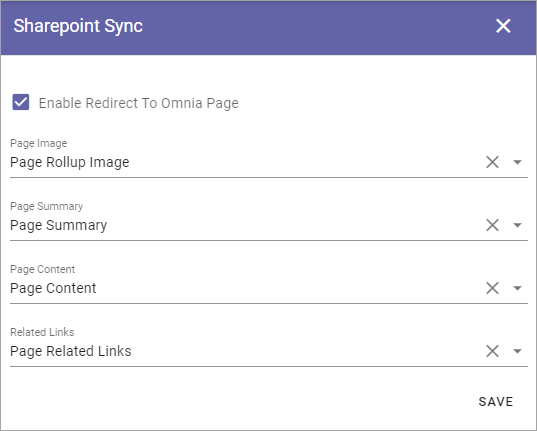

Web Content Management
========================

Here's just one option so far:

.. image:: webcontent-management.png

Coming in Omnia version 6 are the following options:

.. image:: webcontent-management-v6.png

Sharepoint Sync
*****************
Use these settings to configure the sync from Publishing Apps in Omnia to SharePoint Site Pages. What you do is map properties to specific fields in SharePoint.

Open the list for a field and select the property to map to.

+ **Enable Redirect To Omnia Page**: Select this option (default) to redirect Site Pages links to the Omnia page instead of the backend Communication Site Page, when applicable.

These synced pages will be picked up by and displayed by Microsoft Search. When the user clicks on an item in the search result, the user will be redirected to the correct Omnia page. 

**Note!** An administrator can override these sync settings for a specific Page Type, see the heading "Settings" on this page for more information:  :doc:`Page Types </pages/page-types/index>`

Permission
************
In Omnia v6 you can set permissions separately for Web Content Management, here:

.. image:: WCM-permissions-v6.png

This can, for example, be useful if one or more colleagues should be able to work specifically with Tenant Page Types.

Tenant administrators always have permissions for WCM, even if not listed here.

Page Types
*************
(This documentation is just started, more will be added soon).

In Omnia v6, Tenant Page Types can be created, to be used in any Publishing App in the tenant.

The Tenant Page Types are handled from here:

.. image:: WCM-page-types-v6-new.png

You work with the Tenant Page Types exactly the same way as the Publishing App Page Types, as described here: :doc:`Page Types </pages/page-types/index>`

The "only" difference is that the Tenant Page Types are created and edited here, they are not visible in the list "Page Types" in the Publishing App, but are available when an editor creates a new page.

Activating Tenant Page Types
-------------------------------
You activate Tenant Page Types the same way as the Publishing App Page Types, in the settings for the Page Collection:

.. image:: WCM-page-types-activate-v6-new.png

The Page Types can then be used by Page Editors to create pages, the same way as before.

**Important note!** If a Tenant Page Type is edited and published, it is updated for all pages using the Page Type all over the tenant!

Moving a Page Type to Tenant
------------------------------
If you already have one or more Page Types you want to use as a Tenant Page Type, when upgrading to Omnia v6, you can easily "make a Tenant Page Type" of them. 

Select the Page Type and choose "Move To Tenant" in the menu:

.. image:: WCM-page-types-move-to-tenant.png

All pages using the moved Page Type will continue using it, but the Page Type will now fully function as a Tenant Page Type. (See for example the comment about updating a Page Type above).

**Note!** The moved Page Type is removed from the list of Page Types in the Publishing App - it can no longer be edited there. As it is a Tenant Page Type from now on, it must be edited in Omnia Admin. 

Archiving a Tenant Page Type
-------------------------------
You can archive a Tenant Page Type the same way as Page Types in the Publishing App:

.. image:: WCM-page-types-archive-menu.png

Archived Tenant Page Types are placed in the Tenant Archive:

.. image:: WCM-page-types-archive-new.png

This archive works the same way as the archive for the Publishing App Page Types, see the heading "Archive a Page Type" at the bottom od this page: :doc:`Page Types </pages/page-types/index>`
