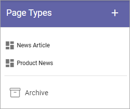
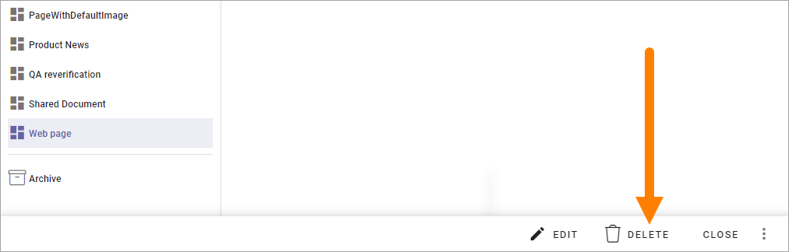

Tenant page types
====================

Tenant page types can be created to be used in any publishing app in the tenant.

The tenant page types are handled from here:

You work with the tenant page types exactly the same way as the local page types, as described here: :doc:`Page types </pages/page-types/index>`

The "only" difference is that the tenant page types are created and edited here, they are not visible in the list "Page types" in the publishing app, but are available when an editor creates a new page.

**A tip!** If you go to a suitable page before going to Omnia admin, the preview can show some content when you edit tenant page types.

Activating tenant page types
******************************
You activate tenant page types the same way as the publishing app page types, in the settings for the page collection. Note the notification (Tenant):

.. image:: WCM-page-types-activate-v6-new.png

The page types can then be used by page editors to create pages, the same way as before.

**Important note!** If a tenant page type is edited and published, it is updated for all pages using the page type all over the tenant!

Moving a page type to tenant
*******************************
If you already have one or more page types you want to use as a tenant page type, you can easily "make a tenant page type" of them. 

Select the page type and choose "Promote to tenant" in the menu:

.. image:: WCM-page-types-move-to-tenant-new.png

All pages using the promoted page type will continue using it, but the page type will now fully function as a tenant page type. (See for example the comment about updating a page type above).

**Note!** The promoted page type is removed from the list of page types in the publishing app - it can no longer be edited there. As it is a tenant page type from now on, it must be edited in Omnia admin. 

Deleting a tenant page type
******************************
You can delete a tenant page type:

(Note that you must save or discard any changes that has not been saved, for the DELETE option to be available).

Deleted Tenant page types are placed in the tenant archive:

.. image:: WCM-page-types-archive-new.png

This archive works the same way as the archive for the local page types, see: :doc:`Delete or restore a page type </pages/page-types/archive-restore-page-type/index>`
