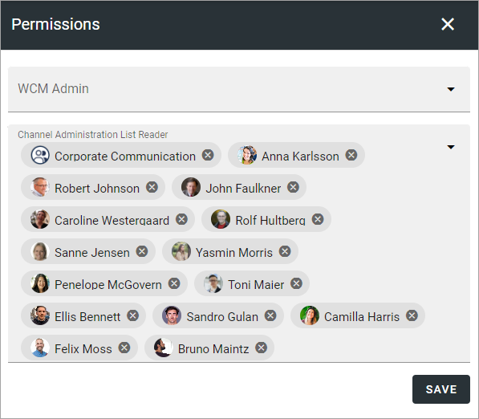

Permission (Web Content Management)
===================================

Here, the following can be set:

+ **WCM Admin**: Add administrators for Web Content Management here. This can, for example, be useful if one or more colleagues should be able to work specifically with Tenant Page Types. **Note!** Tenant administrators always have permissions for WCM, even if not listed here.
+ **Channel Administration List Reader**: Here you can add seperate Publishing Channels Administrators - that will be able to use the Publishing Channels list in Omnia. 

Single users, Security groups and Microsoft 365 groups can be added here (In Omnia on-prem, Microsoft 365 groups can't be used). A user or group must be be permissions enabled to be avaailable here.

