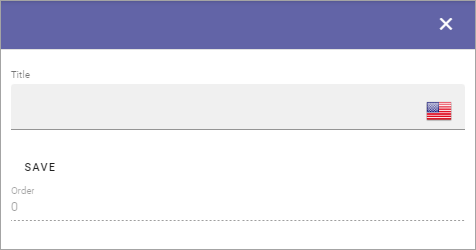

Publishing Channels Categoriries
==============================================

Here you can create categories to use with Publishing Channels. Note that if any categories are set up, it's mandatory to add each channel to a category, when a new channel is created.

If any categories are set up, they are listed here, for example:

.. image:: publishing-channels-categories-list.png

Use the pen to edit a category, the dust bin to delete it.

To create a new category, click the plus:

.. image:: publishing-channels-categories-list-plus.png

Use the followihg settings:

+ **Title**: Add a title in any or several of the tenant languages. Click the flag to change language.
+ **Order**: (A description will be added soon).

