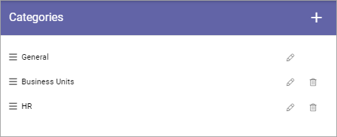

Publishing Channels Categories
==============================================

You can create categories to use with Publishing Channels. Note that it's mandatory to add each channel to a category, when a new channel is created. If no categories are set up, a new channel is automatically added to the default categpry (General). The default category can be renamed here, if needed.

To work with Publishing Channels Categories, click the cogwheel.

.. image:: publishing-channels-categories-gogwheel.png

If any categories are set up, they are listed here, for example:

Use the pen to edit a category, the dust bin to delete it. Note that the category "General" is defaullt and can not be deleted, but it can be renamed.

To create a new category, click the plus:

Add a title for the new category and save:

.. image:: publishing-channels-categories-new2.png

You can add a title in any or several of the tenant languages. Click the flag to change language.

