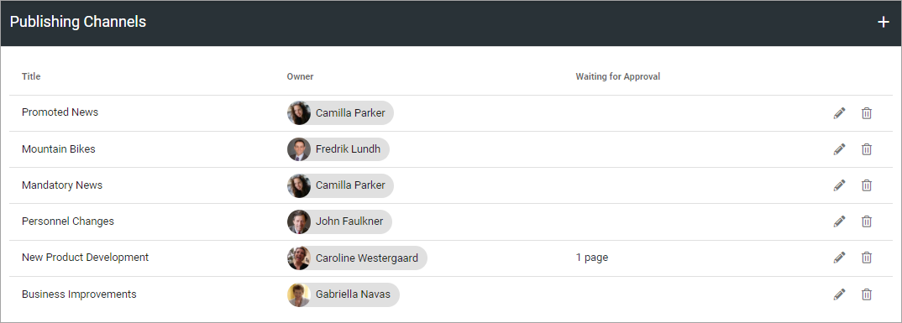

Publishing Channels
===========================

**This is a rpeliminary documentation of new functionality to come in Omnia 6.7.**

Publishing Channels provide an alternative way of targeting information and putting pages into context.

If you enable Publishing Channels on a Page Collection, it will be possible for an author to set which channels the page should be published to. Normally approval by the owner is needed for publication to a channel, but publishers can be defined for a channel and they don't need approval when publishing.

Publishing Channels can be used in page rollups to show news articles and pages in different parts of the intranet. The end user can also subscribe to channels of interest.

Here, you administer the channels.

Click the pen to edit a channel, the dust bin to delete it. When you edit a channel, all settings used when creating a new channel can be edited, see below.

Create a new channel
**********************
Here's how to create a new channel:

1. Click the plus.

.. image:: channels-clickplus.png

2. Use the following settings:

.. image:: channels-settings-new.png

+ **Title**: Add a title in any or several of the tenant langauges. Click the flag to change language.
+ **Description**: Add a description of the purpose of the channel in any or several of the tenant langauges. Click the flag to change language.
+ **Url**: 
+ **ADD IMAGE**: To add an image to be shown for the channel, click here and use the Media Picker to upload the image. When an image is selected you delete it or edit it by clicking the pen. For more information about the Media Picker, see: :doc:`The Media Picker </general-assets/media-picker/index>`
+ **Owner**: One or more owners of the channel must be added.
+ **Administrator**: One or more administrators of the channel must be added.
+ **Publisher**: One or more publishers can be added. This is not mandatory. The colleagues you add here can publish to the channel without approval.
+ **Targeting filter**: A channel can be targeted, meaning the defined colleagues or groups are the only ones that can read the pages published to the channel. Targeting works the same for channels as described for blocks. See the heading "Targeting" on this page: doc:`General settings for blocks </blocks/general-block-settings/index>`

3. Save when you're done.
