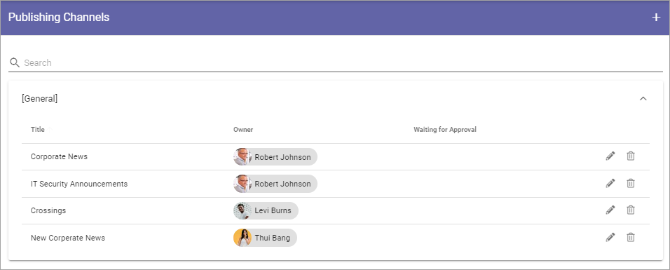
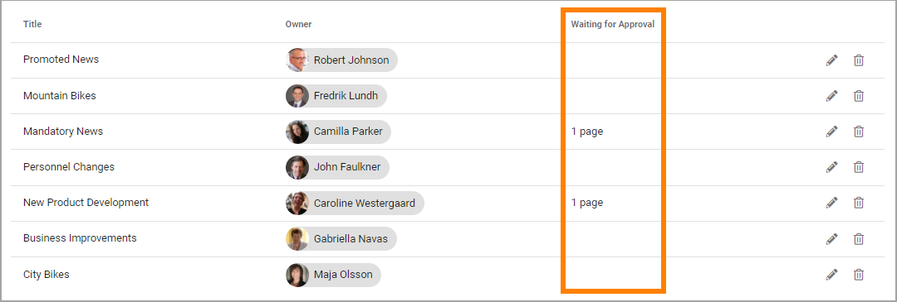
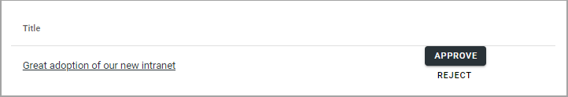

Publishing Channels
===========================

Publishing Channels provide an alternative way of targeting information and place pages in context.

If you enable Publishing Channels on a Page Collection, it will be possible for an author to set which channels the page should be published to. Normally approval by the Administrator of the channel is needed for publication, but publishers can be defined for a channel and they don't need approval when publishing.

Publishing Channels can be used in page rollups to show news articles and pages in different parts of the intranet. The end user can also subscribe to channels of interest. 

Here, you administer the channels. They are listed per Publishing Channels Category. Here's an example:

Click the pen to edit a channel, the dust bin to delete it. When you edit a channel, all settings used when creating a new channel can be edited, see below.

If any publishing to a channel that requires approval has been made, it's noted in the column "Waiting for Approval". The link there can then be clicked to handle the approval, see below.

Also note the search field at the top, where you can search for channels, if the list is long.

You can create and edit categories. See this page for more informaion: :doc:`Publishing Channels Categories </admin-settings/tenant-settings/webcontent-managament/publishing-channels-categories/index>`

Create a new channel
**********************
Here's how to create a new channel:

1. Click the plus.

.. image:: channels-clickplus-new2.png

2. Use the following settings:

.. image:: channels-settings-new3.png

+ **Title**: Add a title in any or several of the tenant langauges. Click the flag to change language.
+ **Description**: Add a description of the purpose of the channel in any or several of the tenant langauges. Click the flag to change language.
+ **Category**: Add a category for the channel. If no categories are setup, the channel is automatically added to the default category. 
+ **Url**: Here you can add a Url to the channel's home page, if there is one. The home page can for example contain more information about the channel, a rollup of all pages published to the channel and so on. 
+ **ADD IMAGE**: To add an image to be shown for the channel, click here and use the Media Picker to upload the image. When an image is selected you can delete it, or edit it by clicking the pen. For more information about the Media Picker, see: :doc:`The Media Picker </general-assets/media-picker/index>`
+ **Owner**: One or more owners of the channel must be added. This is just information about who is responsible. The name/names will be shown when channels are listed.
+ **Administrator**: One or more administrators of the channel must be added. Administrators approve or reject publication to the channel. An administrator also has Publisher permissions to the channel.
+ **Publisher**: One or more publishers can be added. This is not mandatory. The colleagues you add here can publish to the channel without approval.
+ **Force channel description to target group**: Targeting for the channel can be used to add a mandatory subscription to the channel for colleagues or groups. If you want to do that, select this option.
+ **Targeting filter**: Shown when the option above is selected. Targeting settings are done the same way as in other places in Omnia, but the result is different. For the colleagues or groups targeted, a mandatory subscription to the channel is added. For more information about how to set up targeting, see this page : :doc:`Using Targeting </general-assets/targeting-in-omnia/index>`

3. Save when you're done.

Approve or reject publication
*******************************
If you're Administrator of a channel, you can approve or reject publication of pages to that channel, but note that any colleague added as "publisher" for the channel, can publish directly, without approval.

If one or more requests for publication are created, the number of request are shown in this column:

To approve or reject:

1. Click on the number of pages for a channel, to start the process.

The requests for that channel are then listed, for example:

2. Click the link for a page you want to check. The page is opened in a new tab.
3. Go back to the list and select APPROVE or REJECT.

An e-mail is sent to the requester with information about the result.
