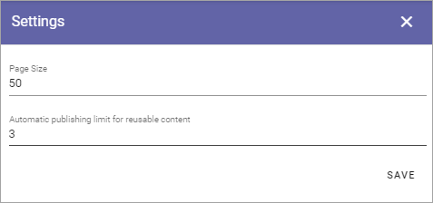

Settings (Web Content Management)
=====================================

These settings can be used in specialized setups. Normally you don't need to change them.

+ **Page Size**: This is a setting for the number of navigation nodes to be opened per level. if there's more nodes, they can be opened by expanding the list the normal way.
+ **Automatic publishing limit for reusable content**: If there are pages where a lot of reusable content are used on other pages, it's a good idea to limit the publishing that occur automatically, for the system to run smoother. It works this way: The number you set here is published automatically. Then a button is shown, that the author must click on for the rest the reusable content publishing to take place.

