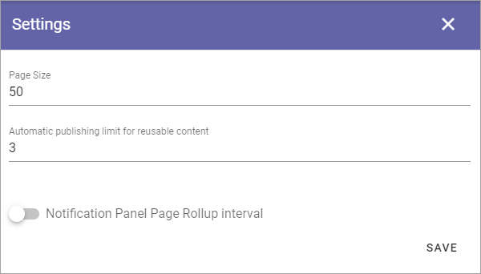
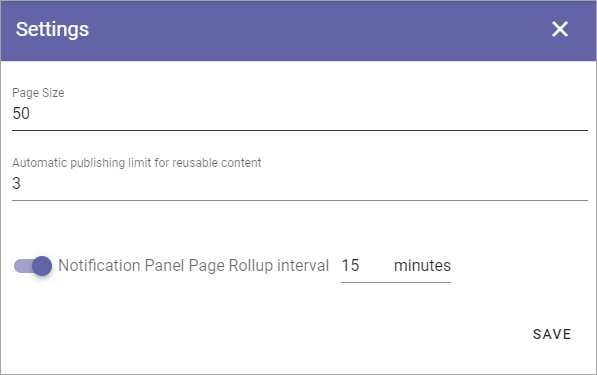

Settings (Web Content Management)
=====================================

These settings can be used in specialized setups. Normally you don't need to change them. (Image from Omnia 6.12).

+ **Page Size**: This is a setting for the number of navigation nodes to be opened per level. if there's more nodes, they can be opened by expanding the list the normal way.
+ **Automatic publishing limit for reusable content**: If there are pages where a lot of reusable content are used on other pages, it's a good idea to limit the publishing that occur automatically, for the system to run smoother. It works this way: The number you set here is published automatically. Then a button is shown, that the author must click on for the rest the reusable content publishing to take place.
+ **Notification Panel Page Rollup interval**: If you would like to set the page rollup interval in the notification panel, select this option. You could test to change this setting if you have performance issues, but it will only have any effect in very rare cases.

Setting the Notification Panel Page Rollup interval
*******************************************************
When you have selected this option, set the interval in minutes, and save. 15 minutes is the default setting.

