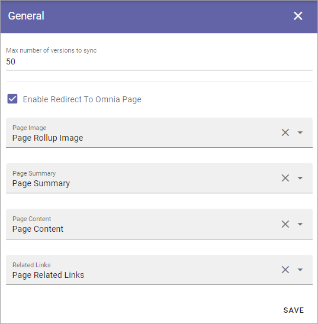
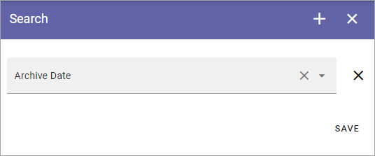

Sharepoint Sync
================

The following can be set here:

.. image:: web-content-sharepoint-sync.png

General
***********
Use these settings to configure the sync from Publishing Apps in Omnia to SharePoint Site Pages. What you do is map properties to specific fields in SharePoint.

+ **Max versions to sync**: If there are several versions of start pages in Omnia, you can set this value to only sync the latest versions to Sharepoint. The sync creates a backup in Sharepoint. Start page versions that are not synced is still present in Omnia.
+ **Enable Redirect To Omnia Page**: Select this option (default) to redirect Site Pages links to the Omnia page instead of the backend Communication Site Page, when applicable. These synced pages will be picked up by and displayed by Microsoft Search. When the user clicks on an item in the search result, the user will be redirected to the correct Omnia page. 
+ **Page Image ect**: Open the list for a field and select the property to map to.

**Note!** An administrator can override these sync settings for a specific Page Type, see the heading "Override Sharepoint Sync Settings" on this page for more information:  :doc:`Page Type Settings </pages/page-types/page-type-settings/index>`

Search
*********
The following can be set here:

Select the property that should be used for Archive Date and save.
