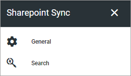
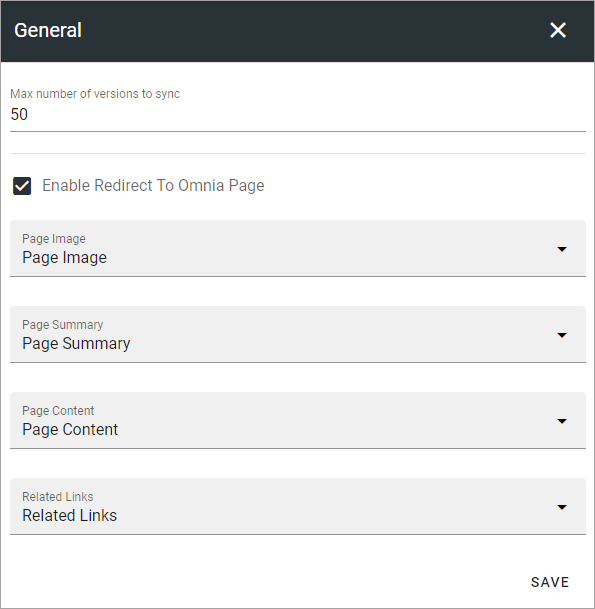
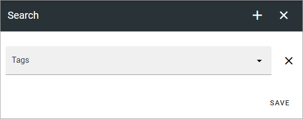

SharePoint Sync
================

The following can be set here:

General
***********
Use these settings to configure the sync from publishing apps in Omnia to SharePoint site pages. What you do is map properties to specific fields in SharePoint.

+ **Max number of versions to sync**: If there are several versions of start pages in Omnia, you can set this value to only sync the latest versions to SharePoint. The sync creates a backup in SharePoint. Start page versions that are not synced are still present in Omnia.
+ **Enable Redirect To Omnia Page**: Select this option (default) to redirect Site Pages links to the Omnia page instead of the backend Communication Site Page, when applicable. These synced pages will be picked up by and displayed by Microsoft Search. When the user clicks on an item in the search result, the user will be redirected to the correct Omnia page. 
+ **Page Image etc**: Open the list for a field and select the property to map to.

**Note!** An administrator can override these sync settings for a specific page type, see the heading "Override SharePoint Sync Settings" on this page for more information: :doc:`Page Type Settings </pages/page-types/page-type-settings/index>`

Search
*********
By default, all normal text in blocks is searchable in full text search, but for example hidden properties are not. If you would like one or more properties to be searchable for full text search, add them here. One example is if you want to use a Keywbords property to make certain terms are searchable even if they are not present as text on the page.

To add properties to the full text search, do the following:

1. Click the plus.
2. Open the list and select a property.
3. Click ADD.

The property is now added to the list, for example:

To additional properties, repeat these steps. To remove a property from the list, click the X.

4. Click SAVE when you're done.
