Knowledge Sharing
===========================================

With Omnia, you can establish a solution for structured knowledge sharing within your intranet.

Start off by watching this `introductory video <https://www.omniaintranet.com/omnia/knowledge/videos/video-omnia-best-practice---knowledge-sharing-communities>`_.

Here is a summary of the best practice recommendations:

* Keep communities open. Anyone in the organization should be able to share their knowledge within a community.
  

* Make sure that every community has at least one moderator. The role of the moderator is to:
  
 * Make sure there are some initial relevant content before community launch.
 * Setup promoted tags in the community and describe how they are going to be used.
 * Decide on activity points in the community and set up relevant badges.
 * Spread the word about the community.
 * Recruit and support community members.
 * Follow up on the level of activity in the community.

* Commitment and adoption is key:

 * Ensure leadership involvement.
 * Make sure to focus on knowledge sharing in the internal intranet marketing work.
 * Make sure you communicate to community members how and why to use rating of content.
 * Follow-up on the whole knowledge sharing solution using governance features in Omnia such as metrics and surveys.

* Make an entry-point for communities and clear navigation to community content:

 * Set up a Community Portal and navigation to it.
 * Create a tutorial to help users get started.
 * Set up a specific search category for community content in Enterprise Search.
 * Set up the community subscription activity feed in the notification panel.

Follow the steps below to setup a solution based on the recommendations above.

.. note:: The instruction is based on Omnia 6.8. If you have another version installed, some labels, page types and layouts may differ.

Prerequisites
--------------------------------------------

1. Go to Omnia Admin > Features (Tenant).
2. Activate the feature "Default Community Properties and Page Types".
3. Go to the Business Profile where you want to deploy communities.
4. Activate the feature "Default Community Template".
5. Refresh the web browser (F5).

EnterPrise Search
---------------------------------------------

Follow these instructions to configure relevant properties and a search category for Communities.

1. Ensure you have a term set setup for Object Types within your SharePoint term store.
2. Add the terms "Community Discussion", "Community Article" and "Community Document".

.. image:: termstore-objecttypes.png

8. Ensure you have an enterprise property setup for Object Type and make it SharePoint Searchable.

.. image:: enterpriseproperty-objecttype.png

9. Go to Omnia Admin > Page Types and select the page type Discussion.
10. Add Object Type as a property. Set the default value to "Discussion" and make sure it is hidden from all edit forms.

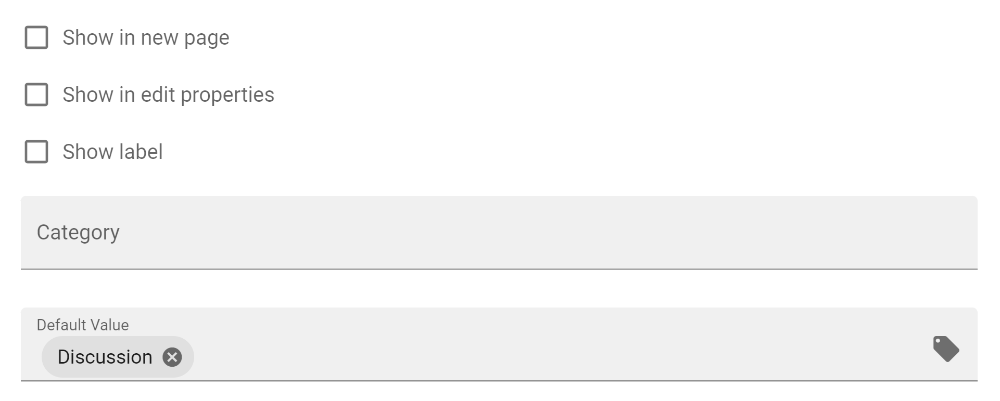

11. Repeat steps 9 - 10 for the page types Knowledge Article and Shared Document.
12. Create a new community.

.. image:: create-demo-community.png

13. Start a new discussion.
14. Grab a cup of coffee and wait for the SharePoint Search to crawl the newly created discussion.
15. Go to SharePoint admin center > More features > Search.
16. Find the crawled property ows_taxid_OmniaObjectType and map it to a refinable string.

.. image:: mapsearchproperty-objecttype.png

17. Find the crawled property ows_SiteName and map it to a refinable string.    

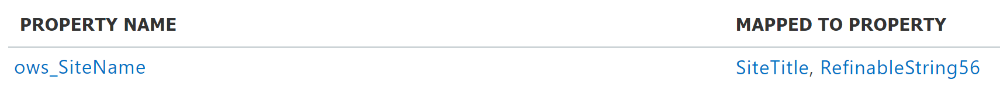

18. Go to Omnia Admin > Properties > Enterprise Properties and update the mapped search settings of the property Object Type.

.. image:: objecttype-searchmapping.png

19. Create a new Enterprise Property that can be used as a search refiner.

.. image:: communityname-searchmapping.png

20. Go to SharePoint admin center > Content services > Term store.
21. Open the term set Object Types and copy the Unique identifiers for the terms Community Article, Community Discussion and Community Document to Notepad for later use.
22. Go to Omnia Admin > [Default business profile] > Search.
23. Create a new search category for Communities.
24. Use "Local SharePoint Results" as result source and create a search query that gets all objects of type Community Article, Community Discussion and Community Document. (Use the unique identifiers that you copied to Notepad.)

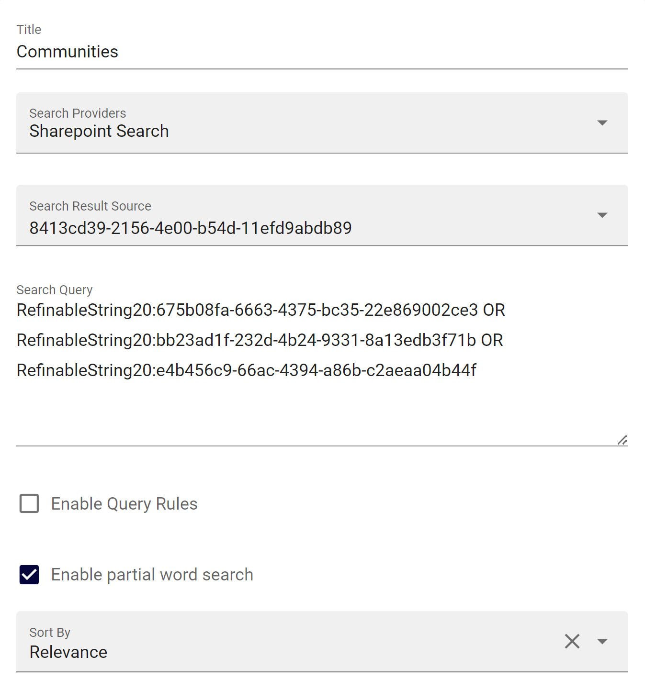

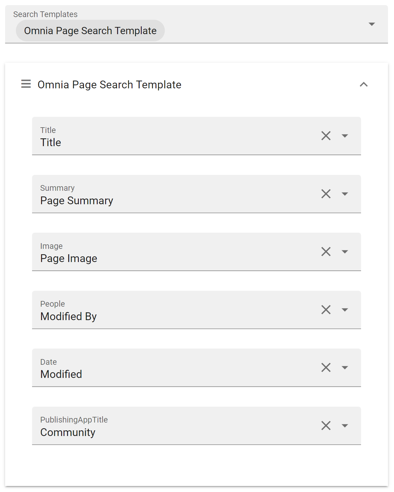

25. Add the search category to Quick Search and Advanced Search.
26. Add refiners in Advanced Search: Object Type, Modified, Community.

.. image:: advancedsearch-refiners.png

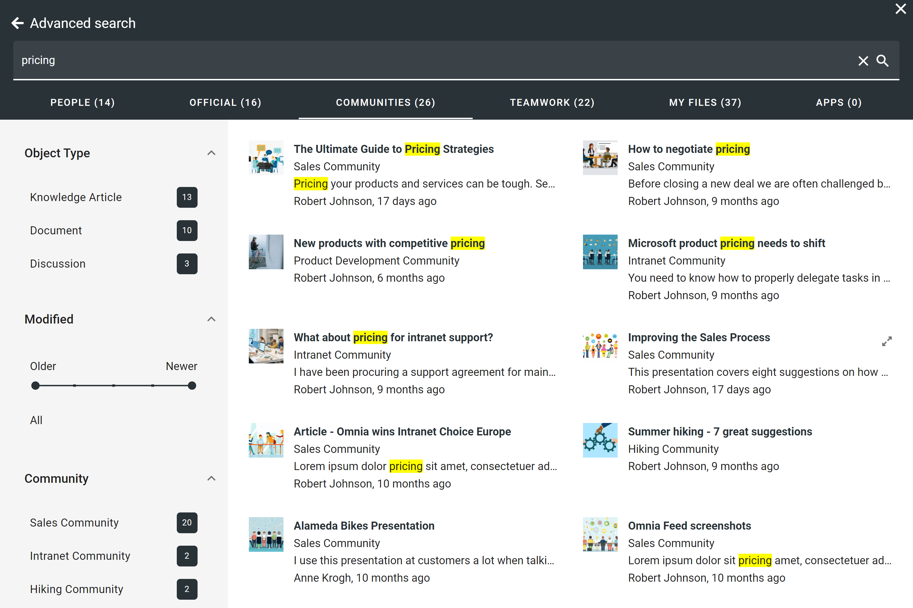

Notification Panel
---------------------------------------------

Follow the steps below to add the community subscription activity feed to the notifcation panel.

27. Create a new category for Communities and add the activity feed block.

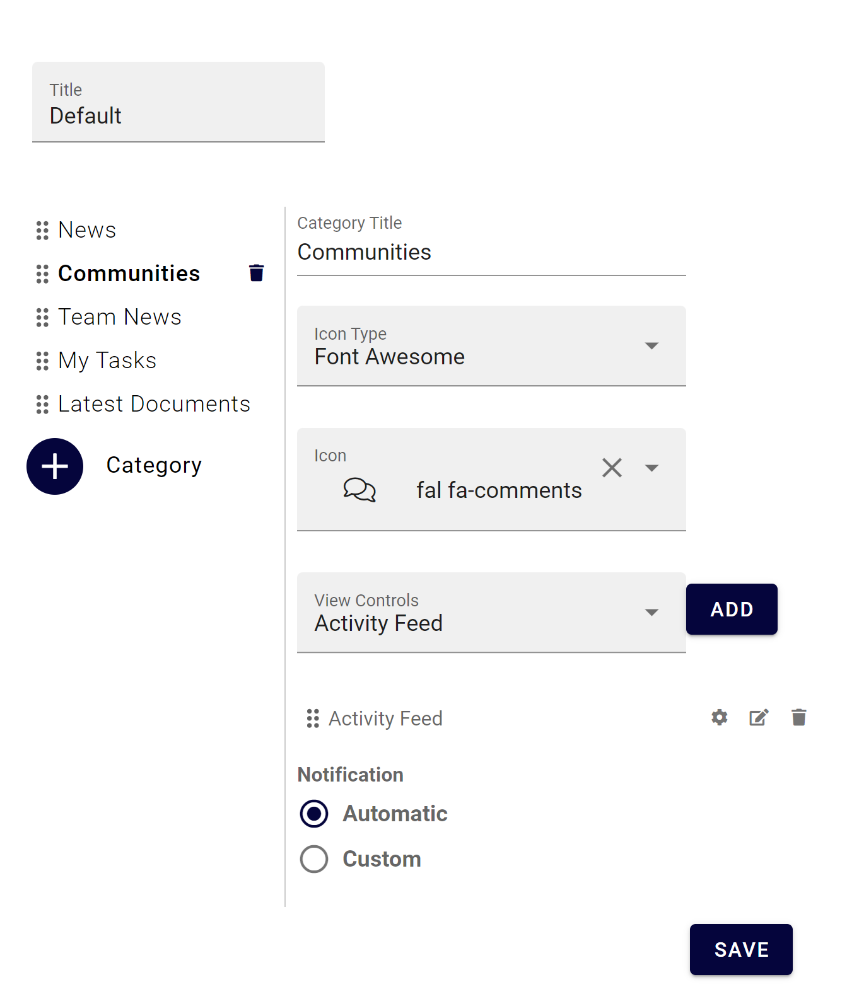

28. Configure the activity feed block accordingly.

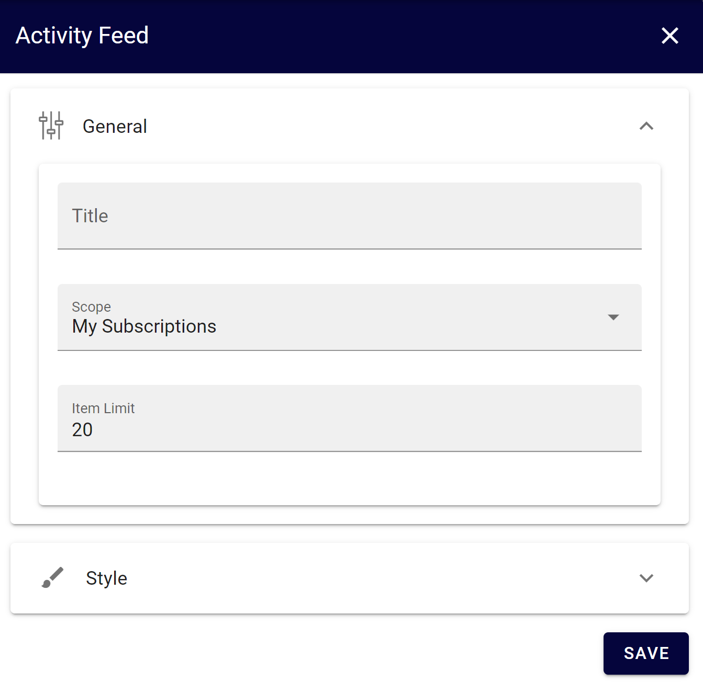

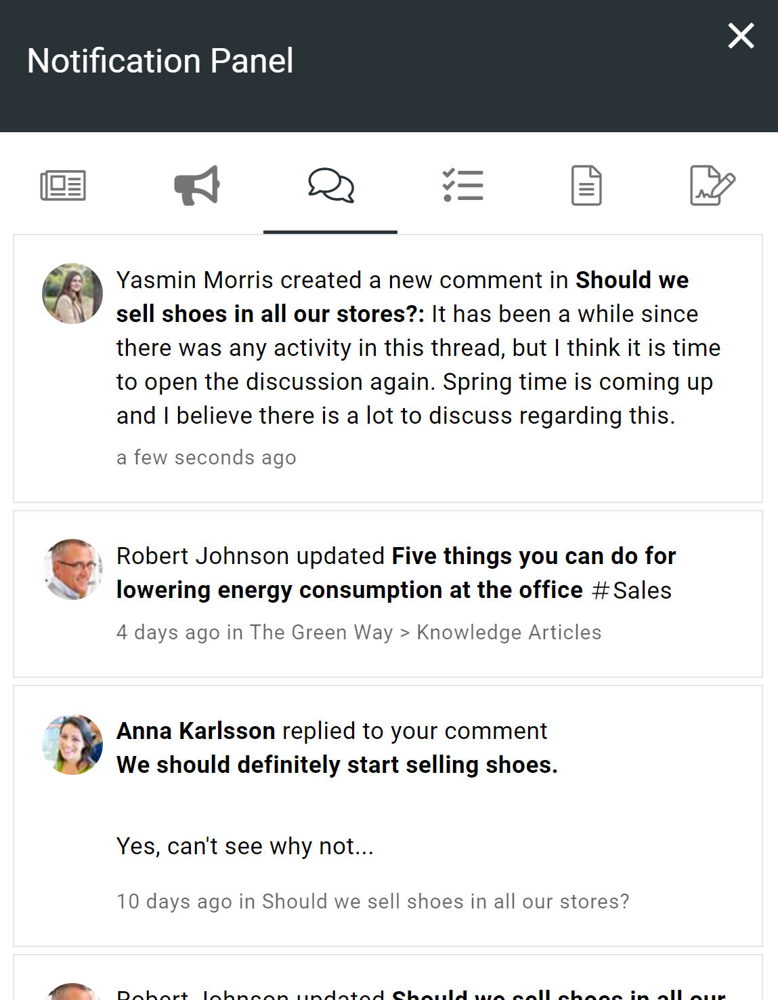

Community Portal
---------------------------------------------

Follow these steps to setup a community portal. 

29. Create a new Publishing App where the community portal can be hosted.

.. image:: create-community-portal.png

30. Create a new Page Collection for the start layout in the community portal.

.. image:: create-pagecollection.png

31. Go into design mode and start adding sections and blocks.

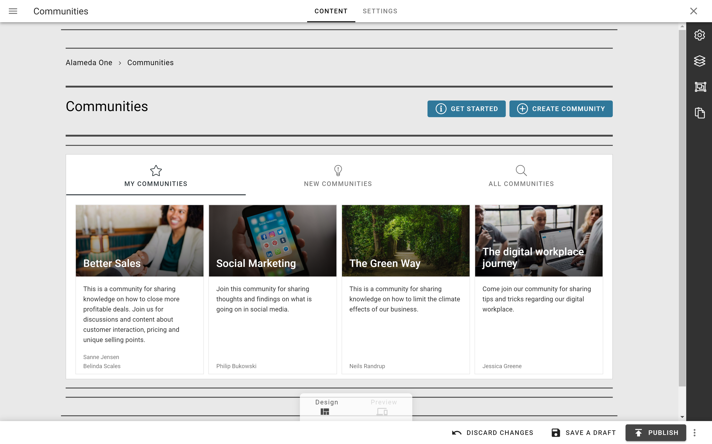

32. The "Get Started" action is only needed if you intend to create a tutorial for the community portal.

.. image:: communityportal-layout-getstarted.png

33. The "Create Community" action should be set as action type "Create App" and only include community templates.

.. image:: communityportal-layout-createcommunity.png

34.  We recommend that you set up a tabbed section with three different rollups. Sort by Title ascending.
35.  My Communities: Scope "Followed" and "Run query on load". Add community templates as filter.
36.  New Communities: Scope "All (Public)" and "Run query on load". Add community templates as filter and Created = "One month from today". Sort by Created descending.
37.  All Communities: Scope "All (Public)" and "Run query on load". Add community templates as filter. Sort by Title ascending. Add a search box to the filter.

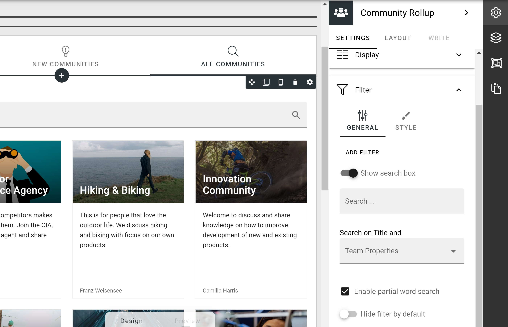

38.  Set the newly created Page Collection as the default page collection in the Publishing App. 
39.  Go to Omnia Admin > Workspace > Navigation Bar and create a link action as an entry-point to the community portal.

.. image:: navigationbaraction-communities.png

40.  To highlight the knowledge sharing solution, we also recommend a banner on the start page, either to the community portal or directly to a newly created community.

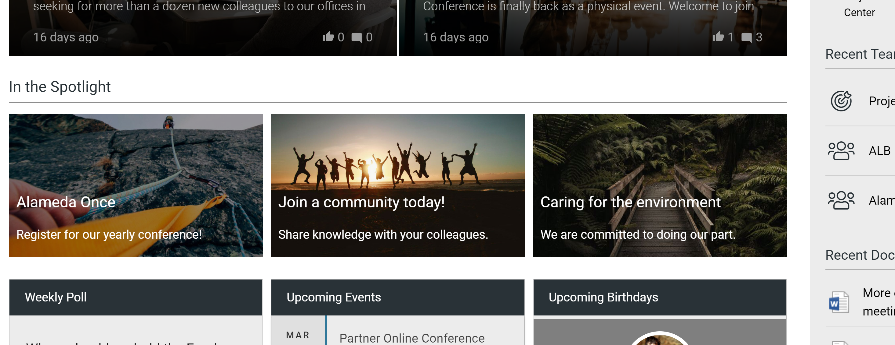
