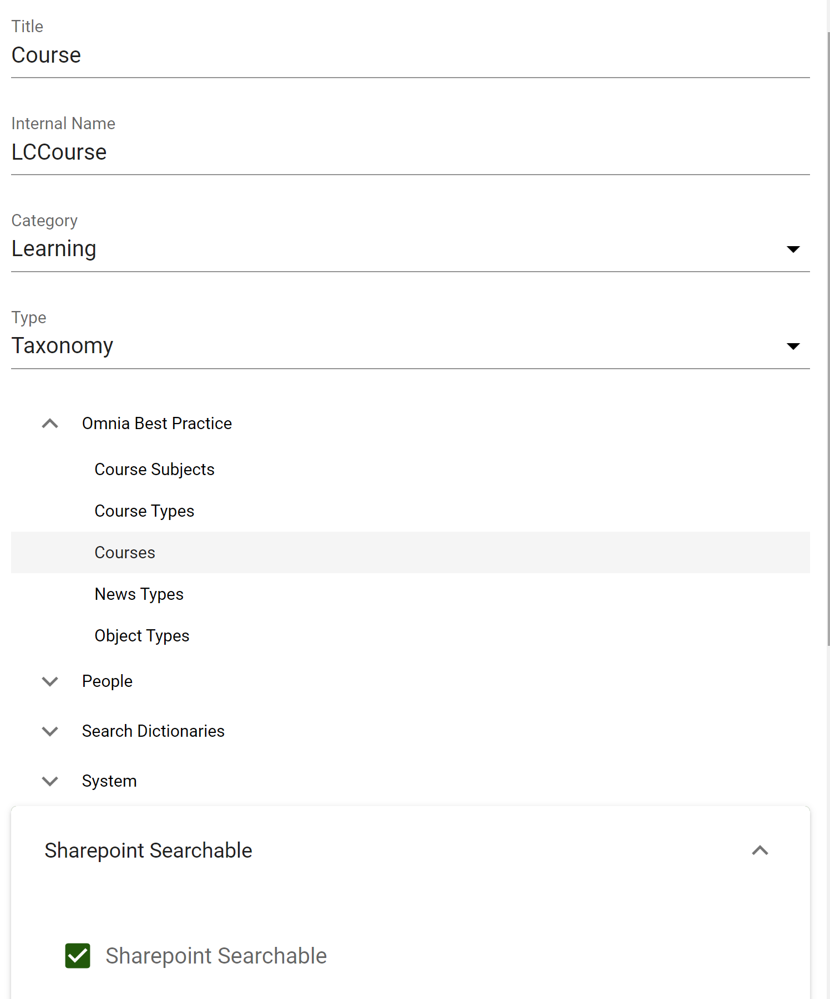

Learning Center
===========================================

With Omnia, you can establish a learning center within your intranet.

Start off by watching this `introductory video <https://www.omniaintranet.com/omnia/knowledge/videos/video-omnia-best-practice---learning-center>`_.

Here is a summary of the best practice recommendations:

* Form a strategy for how to develop, provide, and maintain learning resources within the organization.

* Organize your course catalogue in course subjects and course types.

 * Course subjects are familiar topics related to your business, like IT, leadership, products, and sales.
 * Course types can describe whether the course is internal, external or self-service.

Course Subjects and Course Types
---------------------------------------------

1. Go to SharePoint admin center > Content services > Term store.
2. Create a new Term Set called Course Types. Add the following terms and change the sort order accordingly:

  * Internal course
  * Self-service
  * External course

3. Create a new Term Set called Course Subjects. Add the following terms:

  * IT
  * Leadership
  * Products
  * Sales

4. Create a new empty Term Set called Courses.

5. Go to Omnia Admin > Properties > Categories.
6. Create a new category called "Learning". 
7. Go to Omnia Admin > Properties > Enterprise Properties.
8. Create a new property for Course Subject. (Don't forget to make it SharePoint Searchable).

.. image:: best-practice-learning-center-property-coursesubject.png

9. Create a new property for Course Type.

.. image:: best-practice-learning-center-property-coursetype.png

10. Create a new property for Course.

11. Go to Omnia Admin > Properties > Queryable Properties.
12. Add Course Subject, Course Type and Course to Pages.

.. image:: best-practice-learning-center-queryableproperties.png

Page layouts
----------------------------------------------
1. Go to Omnia Admin > Web Content Management > Page Layouts.
2. Create a new page layout for "Internal Course". (It can be based on the news article layout and then customized according to needs.)
    
.. image:: best-practice-pagelayout-course.png

Page Rollup Query (Left-hand side):

.. image:: best-practice-pagelayout-course-pagerollup-left.png

Page Rollup Query (Right-hand side):

Token: {{PublishingApp.PageCollections["course-dates"]}}

.. image:: best-practice-pagelayout-course-pagerollup-right.png

Learning Center Publishing App
----------------------------------------------

1. Go to Omnia Admin > [Default Business Profile] > Publishing.
2.  Create a new publishing app for the Learning Center.

.. image:: best-practice-learning-center-create-app.png

11. Go to the newly created publishing app and create a page collection for the start page of the Learning Center.

.. image:: best-practice-learning-center-pagecoll-start.png

12. Create a flat page collection for courses.

.. image:: best-practice-learning-center-pagecoll-courses.png

13. Create a flat page collection for course dates.
    
.. image:: best-practice-learning-center-pagecoll-coursedates.png

