News Management
===========================================

With Omnia, you can establish a solution for news management within your intranet.

Start off by watching this `introductory video <https://www.omniaintranet.com/omnia/knowledge/videos/video-omnia-best-practice---news-management>`_.

Here is a summary of the best practice recommendations:

* Before you start the implementation of your news management solution, make sure that you have established an information model that can serve as a basis for which tool to use for what.
  
* Official global news are setup in a separate publishing app and:
 * Are managed by a group of global editors.
 * Use scheduling to plan ahead.
 * Supports translation using the variation system.
 * Use approval to support local authors.
 * Have a structured set of news types and add the possibility to highlight promoted news.

* Official local news are setup in a separate publishing app and:
 * Have a large group of local authors that own their own news articles and can invite co-authors on demand.
 * Have a set of properties setup that can be used to target the news articles to the correct audience.
 * Are using the user profile to make targeting and subscription available.

* Official news can reach the correct audience by:
 * Showing promoted news on the intranet start page.
 * Targeting news using the notification panel.
 * Setting up a news center with different top lists and possiblitiy to search for news.
 * Deploy the Omnia mobile app, newsletters and the digital signage solution.

* Team announcements and posts:
 * Use teamwork to manage news targeted to a small group (< 50 people).
 * If you are using Microsoft Teams, use a specific announcement channel for official news and the general channel for non-official news.
 * If you are not using Microsoft Teams, use SharePoint Team News for official news and Omnia teamwork posts for non-official news.

* Community and organization-wide posts:
 * Use Omnia community posts to communicate non-official news to a community.
 * In a small/mid-sized organization, you can allow organization-wide posts either in Microsoft Teams or by using Omnia organization-wide posts. 

Follow the steps below to setup a solution based on the recommendations above.

.. note:: The instruction is based on Omnia 6.10. If you have another version installed, some labels, page types and layouts may differ.

Global News
-----------------------------------------------

Follow these instructions to configure a publishing app for global news with variations and approval.

1. Go to Microsoft 365 admin center > Teams & groups and create two new security groups: "Global News Editors" and "Global News Authors". Add appropriate members to the groups.
2. Go to Omnia Admin and create a new publishing app for "Global News".
3. Go to the newly created publishing app and create a default page collection.

.. image:: globalnews-createpagecollection.png

4. Select "News Center - Grey" as layout template.
5. Go to the page collection settings and configure the following:
 
 * Change the Dialog Title to "Create Global News Article".
 * Uncheck "Show Url".
 * Add the page type "News Article (Tenant)".
 * Enable approval and select a limited list of editors that should be responsible for approval.
 * Enable scheduling and select "Article Date".

.. image:: globalnews-pagecollectionsettings1.png

---------

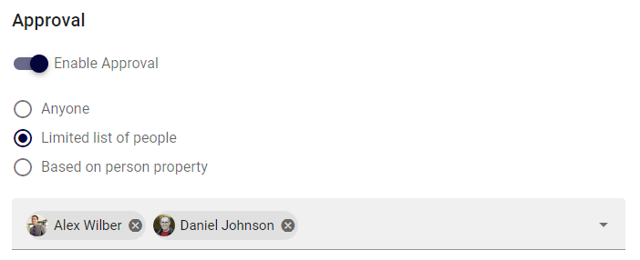

---------

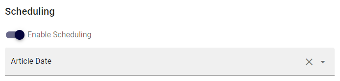

6. Set permissions on the page collection based on the previously created security groups.

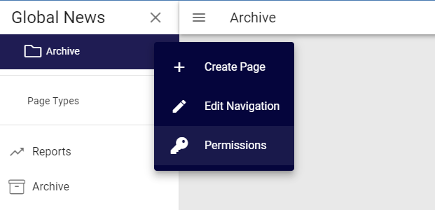

---------

.. image:: globalnews-permissions2.png

7. Go to the publishing app settings.
8. Set the previously created page collection as default and save.
9. Go to the variations tab.
10. Create a default variation.
    
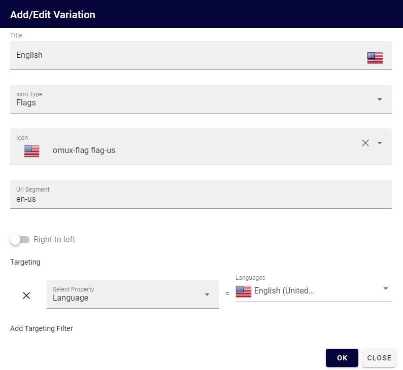

11. Create a variation with automatic translation.

.. image:: globalnews-variations2.png

12.  Ensure the properties News Type (Taxonomy) and Promoted (Yes/No) on the News Article page type.

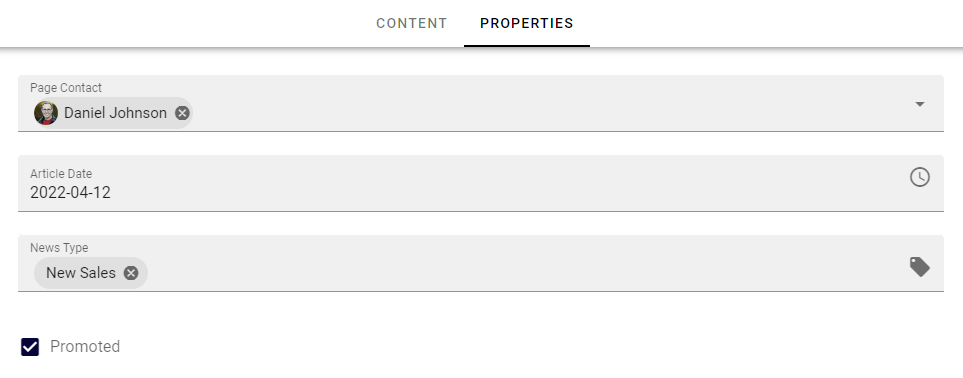

Local News
-----------------------------------------------

Follow these instructions to configure a publishing app for local news.

1. Go to SharePoint admin center > Content services > Term store and ensure term sets for Organization and Location.

.. image:: termsets-orgloc.png

2. Go to SharePoint admin center > More features > User profiles > Manage User Properties
3. Create user profile properties for organizational and location belonging.

.. image:: userprofileproperty-organization.png
    
---------

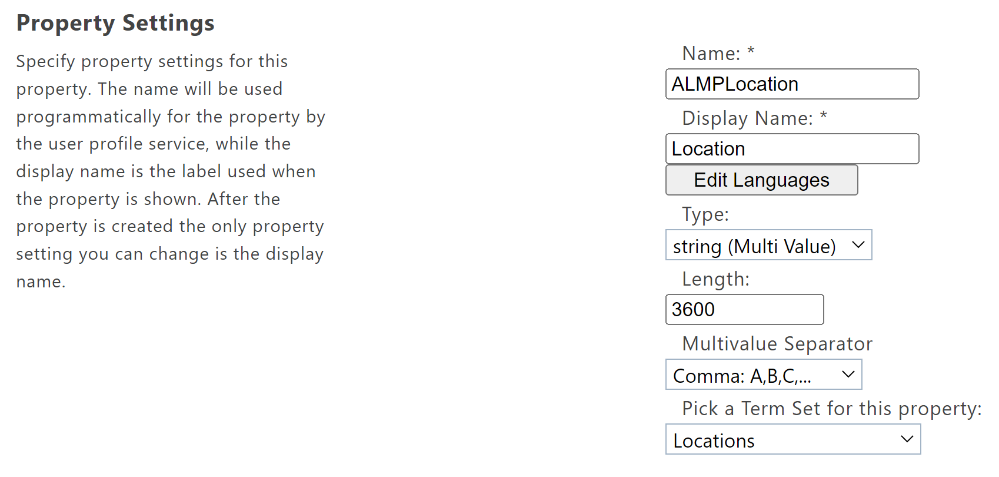
   
4. Create user profile properties for organizational and location subscription.

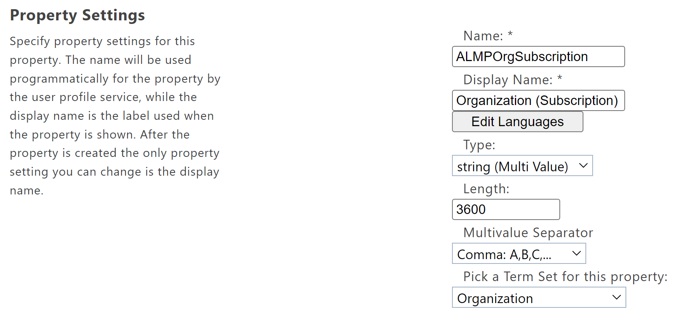
    
---------

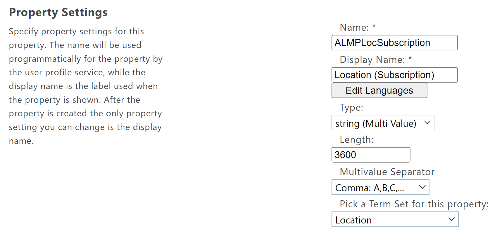

5. Go to Omnia Admin > Properties > Enterprise Properties and create taxonomy properties for Organization and Location.

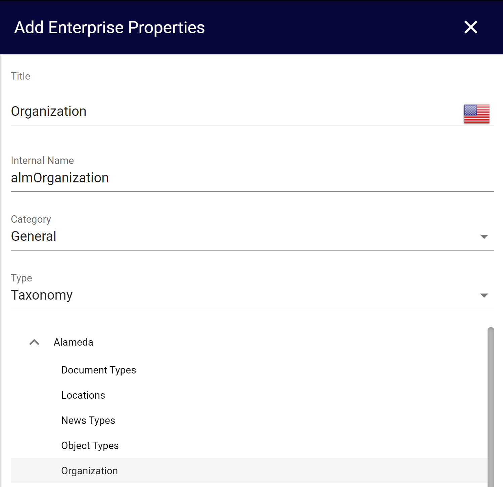

6. Go to Omnia Admin > Properties > Queryable Properties > Pages and add the properties Organization and Location.
7. Go to Omnia Admin > Properties > Targeting Properties and add the following properties.

.. image:: organization-belonging.png

.. image:: organization-subscription.png

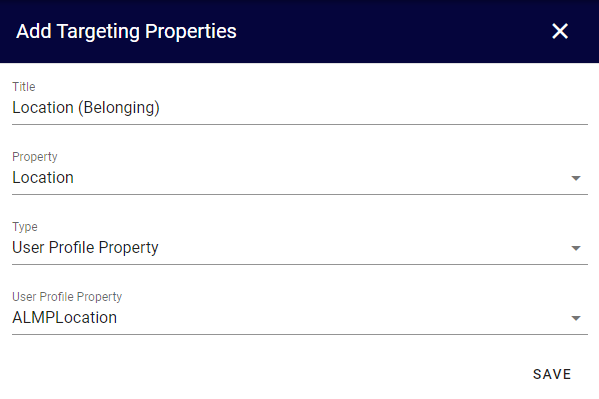

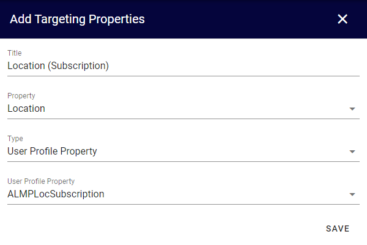

8. Go to Omnia Admin > Web Content Management > Page Types and create a new page type: "Local News Article".
9. Use the layout template "News Page - Grey".
10. Add the following properties to the page layout:

.. image:: localnews-settings.png

* Object Type should be hidden from the edit dialog with default value "News Article".
* Page Type should default to "Current User".
* Article Date should default to "Today".
* Organization and Location should allow multiple values.

11. Go to Microsoft 365 admin center > Teams & groups and add a new security group: "Local News Authors". Add appropriate members to the group.
12. Go to Omnia Admin and create a new publishing app for "Local News".
13. Go to the newly created publishing app and create a default page collection.

.. image:: globalnews-createpagecollection.png

14. Select "News Center - Grey" as layout template.
15. Go to the page collection settings and configure the following:
   
 * Change the Dialog Title to "Create Local News Article".
 * Uncheck "Show Url".
 * Add the page type "Local News Article (Tenant)".
 * Check "Break permission inheritance by default" and "Allow invitation of co-authors".

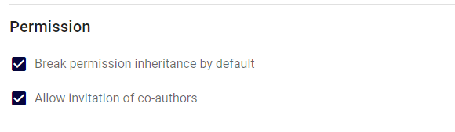

16. Set permissions on the page collection based on the previously created security group.

.. image:: localnews-permissions.png

17. Go to the publishing app settings.
18. Set the previously created page collection as default and save.