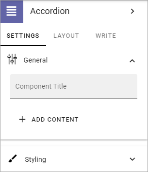
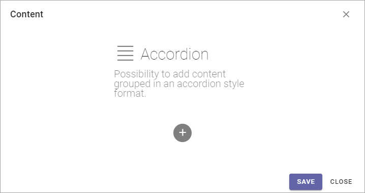
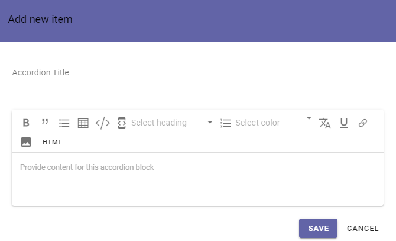

Accordion
=====================

With this block you can add the posibility to enter expandle text on a page. The content is added using Write mode.

In Omnia 6.5, this block is replaced by the FAQ block, see this page for more information: :doc:`The FAQ block </blocks/faq/index>`

Also note that in Omnia 6.5 there's an Accordion section available, but that's a section, not a block.

For the end user an Accordion entry can look like this:

.. image:: accordion-entry.png

And when expanded:

.. image:: accordion-entry-expanded.png

The settings
*************
The settings you can do are the following:

.. image:: accordion-settings-new2.png

General
--------------
Under General you can set the following:

+ **Component Title**: If a title should be shown for the block, add it in this field. If no variation exists for the page, it looks like in the image above and you can set the title in the languages active in the tenant. If variations exists, only one title can be set. In that case, titles in other languages are set in the variations.
+ **ADD CONTENT**: If you want to add some default content to the block, click here. Also see below.

Add Content
-------------
When you click ADD CONTENT, the following is shown:

You add content here the same way as described under *Adding Accordion Text* below. You can use the WRITE tab to set if this default content can be edited or not, see below.

Styling
---------
Under "Styling" you can set colors and padding:

.. image:: accordion-settings-styling-new2.png

Layout
----------
The LAYOUT tab contains general settings, see: :doc:`General Block Settings </blocks/general-block-settings/index>`

Write
-----------
Here you can set the following:

.. image:: accordion-write-tab.png

+ **Enable overwrite in write mode**: If it should be possible for editors to overrite the default content in the block, this option should be on. If not, click to set the option to off.
+ **Page Property to store data**: Select property for the possibibilty to reuse content anywhere else on the page.

Adding Accordion Text
************************
When the Accordion block has been added to a page, and the page has been published, it can be used this way by an editor:

1. Enter Write mode.
2. Click the plus in the Accordion block.

Something like the following is shown (available options depends on admin settings):

3. Add an Accordion Title at the top. This is the expandable text.
4. Add the text that should be shown when the title is expanded. Note the formatting options.

Here's an example:

.. image:: accordion-example-new3.png

5. Click "SAVE".
6. Add additional Accordions to the block the same way.

To edit an Accordion, click the pen. To delete an Accordion, click the dust bin.

.. image:: accordion-edit-delete-new3.png

