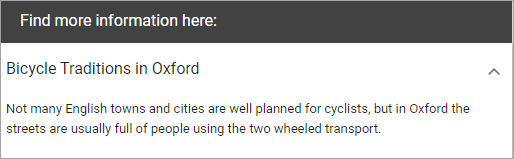
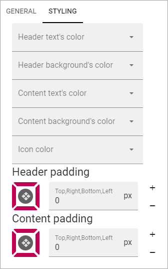
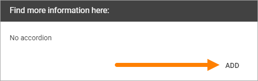
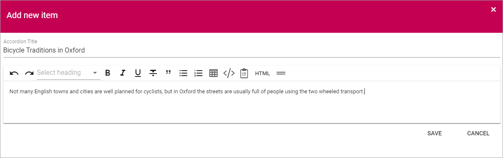
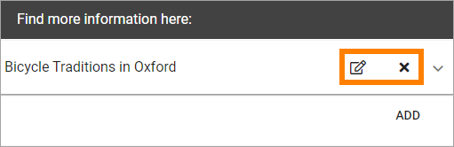

Accordion
=====================

With this block you can add the posibility to enter expandle text on a page. The content is added using the Write mode.

For the end user and Accordion entry can look like this:

.. image:: accordion-entry.png

And when expanded:

The settings
*************
The settings you can do are the following:

.. image:: accordion-settings-new.png

General
--------------
Under General you can set the following:

.. image:: accordion-settings-general-new.png

+ **Component Title**: If a Title should be shown for the block, add it in this field. If no varition exists for the page, it looks like in the image above and you can set the title in the languages active in the tenant. If a varition exists, only one title can be set. In that case, titles in other languages are set in the variations.
+ **Page Property to store data**: Select property for the possibibilty to reuse content anywhere else on the page.

Styling
---------
Under "Styling" you can set colors and padding for the content.

Layout and Advanced
---------------------
The tabs Layout and Advanced contain general settings, see: :doc:`General Block Settings </blocks/general-block-settings/index>`

Adding Accordion Text
************************
When the Accordion block has been added to a page, it can be used this way by an editor:

1. Enter Write mode.
2. Click "ADD" in the Accordion block.

The following is shown:

.. image:: accordion-new.png

3. Add an Accordion Title at the top. This is the expandable text.
4. Add the text that should be shown when the title is expanded. Note the formatting options.

Here's an example:

5. Click "SAVE".
6. Add additional Accordions to the block the same way.

To edit an Accordion, click the pen. To delete an Accordion, click the x.

