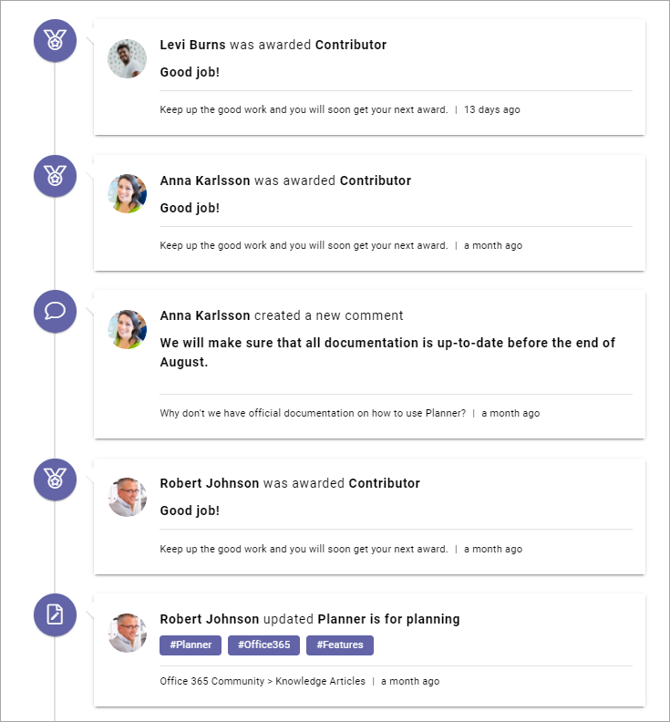
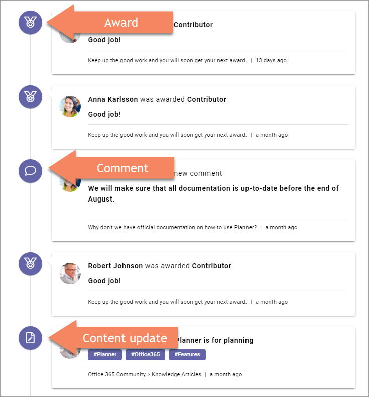
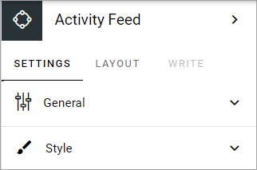
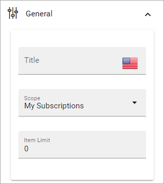
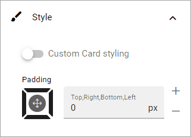

Activity feed
=================

Use this block to show activities for the subscriptions the logged in user has or for activities on content pages.

Here's an example of an activity feed with the scope set to My subscriptions:

The icon indicates the type of activity:

There's an additional icon not shown in the image above:

.. image:: activity-feed-example-icons-additional.png

The icon at the bottom, with the arrow pointing down, is the "see more" icon displayed when there are more items to show.

Settings
**********
The following settings are available for the block:

General
----------
Here, you can set the following:

+ **Title**: You can add a title to be shown in the block. 
+ **Scope**: Select where the activities listed should come from: My subscritions, the publishing app or the page collection. See more information about the scope below.
+ **Item limit**: Set the number of items to be shown in the list before a See more icon is shown (see above for an example). Default=10.

Style
-------
Here, some style options are available for the block:

+ **Custom card styling**: General block styling, that is the color and the like, are set in Omnia admin. If you choose “Custom card styling” you can edit a number of style settings specifically for this block.
+ **Padding**: Set some padding between the block border and the list, if needed.

More on scope
---------------
The Scope setting results in the following:

+ **My subscriptions**: All activities for everything the logged in user subscribes to is listed.
+ **Publishing app**: Lists all pages in the CURRENT publishing app that are either new or have been updated. This is tied to the publication of a page, so whenever a new page is published, it results in an activity, whenever an existing page is republished, it results in an activity.
+ **Page collection**: Lists all pages in the CURRENT page collection that are either new or have been updated. This is tied to the publication of a page, the same way as for publishing apps.

Generally, a user will never be able to read a page the person does not have permissions to read. In some unusal events, an activity may be present in the feed even if the user does not have access to the page, but if that should happen, the page is simply not shown when the link is clicked. 

Layout and Write
******************
The Write tab is not used here. The Layout tab contains general settings for blocks. For more information see: :doc:`General block settings </blocks/general-block-settings/index>`

